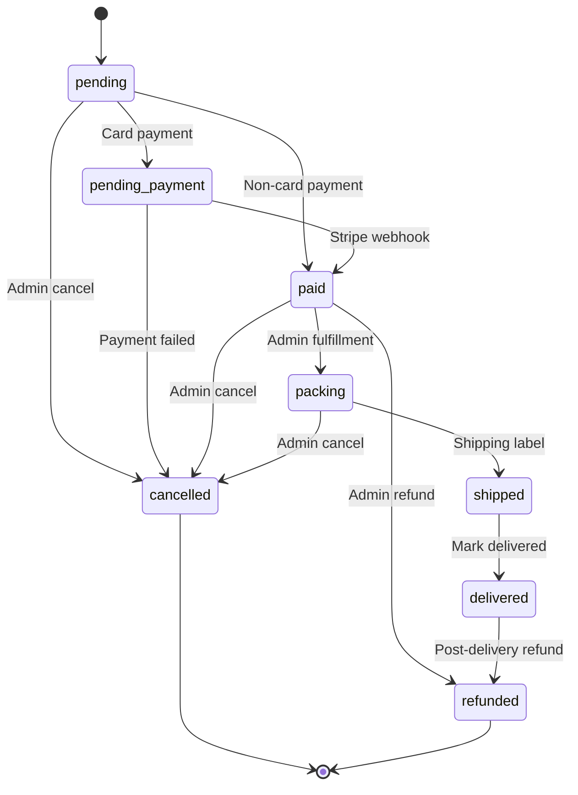
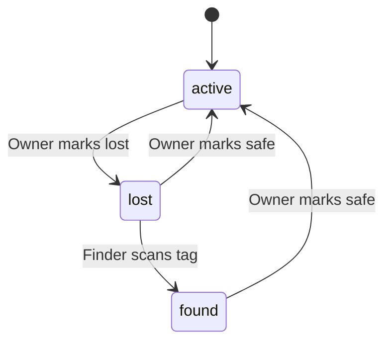

# PawTag — Complete Business Rules

**Last updated:** 2026-08-28
**Status:** Current — reflects actual codebase state

---

## 1. Authentication & Account Rules

### 1.1 Registration

| Rule | Value | Enforced At |
|------|-------|-------------|
| Email required | Yes, valid format | `schemas.ts` (Zod) |
| Password minimum length | 8 characters | `schemas.ts` |
| Password complexity | Uppercase + lowercase + number + special char | `schemas.ts` |
| Email verification | Required before full access | `auth.ts` |
| Phone verification | Optional at registration | `auth.ts` |
| Duplicate email | Rejected (unique index) | `User.ts` model |
| MFA on registration | Disabled by default | `mfa.customerEnabled` setting |

### 1.2 Login

| Rule | Value | Enforced At |
|------|-------|-------------|
| Failed login lockout | 5 attempts → 30min lockout | `auth.ts` brute-force protection |
| CAPTCHA after failures | After 2 failed attempts | `captcha.ts` middleware |
| Login notification | Email sent to user on every login | `login-notification.ts` template |
| Admin login notification | Email sent to admin on admin login | `auth.ts` |
| Account status check | Blocked if status != 'active' | `auth.ts` |
| MFA required | Configurable per role (`mfa.adminEnabled`, `mfa.customerEnabled`) | `auth.ts` |

### 1.3 Token Management

| Rule | Value | Enforced At |
|------|-------|-------------|
| Access token expiry | 30 minutes | `config.ts` |
| Refresh token expiry | 30 days | `config.ts` |
| Refresh token rotation | New pair issued on each refresh | `auth.service.ts` |
| Refresh token revocation | Old token revoked on rotation | `auth.service.ts` |
| Token storage (web) | localStorage | Frontend |
| Token storage (mobile) | expo-secure-store | Mobile app |

### 1.4 Password Reset

| Rule | Value | Enforced At |
|------|-------|-------------|
| Reset token expiry | 15 minutes | `auth.ts` |
| Reset link sent via | Email only | `password-reset.ts` template |
| Password changed notification | Email sent to user | `password-changed.ts` template |
| Admin password reset | Admin can reset any user's password | `admin.ts` |

---

## 2. Order Lifecycle Rules

### 2.1 Status State Machine

### 2.2 Valid Transitions

| From | Allowed Next | Enforced At |
|------|-------------|-------------|
| `pending` | `pending_payment`, `paid`, `cancelled` | `orderStatus.service.ts` |
| `pending_payment` | `paid`, `cancelled` | `orderStatus.service.ts` |
| `paid` | `packing`, `cancelled`, `refunded` | `orderStatus.service.ts` |
| `packing` | `shipped`, `cancelled` | `orderStatus.service.ts` |
| `shipped` | `delivered` | `orderStatus.service.ts` |
| `delivered` | `refunded` | `orderStatus.service.ts` |
| `cancelled` | *(terminal — no transitions)* | `orderStatus.service.ts` |
| `refunded` | *(terminal — no transitions)* | `orderStatus.service.ts` |

### 2.3 Order Creation Rules

| Rule | Value | Enforced At |
|------|-------|-------------|
| Order created via | `POST /customer/orders/place` (direct API) or webhook backup | `customer.ts`, `medusa-webhooks.ts` |
| Order number format | `PT-NNNNNN` (6-digit padded) | `order-creation.service.ts` |
| Invoice number format | `INV-NNNNNN` (6-digit padded) | `order-creation.service.ts` |
| Idempotency | Duplicate `medusaOrderId` rejected | `order-creation.service.ts` |
| Payment status | `completed` on creation (Medusa handles payment) | `order-creation.service.ts` |
| Currency | NZD (default) | `Order.ts` model |

### 2.4 Cancel Rules

| Rule | Value | Enforced At |
|------|-------|-------------|
| Cancellation reason | Required (not empty) | `admin.ts` |
| Valid from states | `pending`, `pending_payment`, `paid`, `packing` | `orderStatus.service.ts` |
| Stock restoration | Medusa owns inventory (PawTag no-op) | `inventory.service.ts` |
| Medusa sync | `cancelMedusaOrder()` called (best-effort) | `medusa-admin.service.ts` |
| Customer notification | Email + in-app + push | `orderNotification.service.ts` |
| Audit logged | Yes, HIGH severity | `admin.ts` |

### 2.5 Refund Rules

| Rule | Value | Enforced At |
|------|-------|-------------|
| Refund reason | Required (not empty) | `admin.ts` |
| Valid from states | `paid`, `delivered` | `orderStatus.service.ts` |
| Stripe refund | `createRefund()` called with `stripePaymentIntentId` | `stripe.service.ts` |
| Medusa sync | `cancelMedusaOrderAfterRefund()` called | `medusa-admin.service.ts` |
| Customer notification | Email + in-app + push | `orderNotification.service.ts` |
| Audit logged | Yes, CRITICAL severity | `admin.ts` |

### 2.6 Shipping Rules

| Rule | Value | Enforced At |
|------|-------|-------------|
| Valid from states | `packing` | `orderStatus.service.ts` |
| Medusa sync | `createMedusaFulfillment()` + `createMedusaShipment()` | `medusa-admin.service.ts` |
| Tracking number | Required for shipment creation | `shipping.service.ts` |
| Customer notification | Email with tracking URL + in-app + push | `orderNotification.service.ts` |
| Audit logged | Yes, HIGH severity | `admin.ts` |

### 2.7 Delivery Rules

| Rule | Value | Enforced At |
|------|-------|-------------|
| Valid from states | `shipped` | `orderStatus.service.ts` |
| Manual action only | Admin marks delivered (no courier webhook) | `admin.ts` |
| Customer notification | Email + in-app + push | `orderNotification.service.ts` |

---

## 3. Subscription Rules

### 3.1 Plan Types

| Plan | Price (NZD) | Free Period | Renewal |
|------|-------------|-------------|---------|
| Annual | $0.99/year | 12 months | Auto-renew yearly |
| Monthly | $1.99/month | 12 months | Auto-renew monthly |
| Free | $0 | 12 months | No renewal |

### 3.2 Subscription Lifecycle

| Rule | Value | Enforced At |
|------|-------|-------------|
| Free period | 12 months from activation | `subscription.service.ts` |
| Grace period | 4 weeks after expiry | `subscription.service.ts` |
| Auto-renewal | Enabled by default | `subscription.service.ts` |
| Renewal method | Annual or Monthly (matches plan) | `subscription.service.ts` |

### 3.3 Expiry Reminders

| Reminder | Timing | Channel |
|----------|--------|---------|
| 30-day reminder | 30 days before expiry | Email |
| 7-day reminder | 7 days before expiry | Email |
| 1-day reminder | 1 day before expiry | Email |
| Grace period weekly | Weekly during 4-week grace | Email + in-app |

### 3.4 Grace Period Rules

| Rule | Value | Enforced At |
|------|-------|-------------|
| Grace period duration | 4 weeks | `subscription.service.ts` |
| Tag status during grace | `grace_period` (finder still works) | `finder.ts` |
| Finder access during grace | Allowed (limited info) | `finder.ts` |
| Weekly reminders during grace | Up to 4 reminders | `subscription.service.ts` |
| After grace expires | Status → `expired`, tag deactivated | `subscription.service.ts` |

### 3.5 Cancellation Rules

| Rule | Value | Enforced At |
|------|-------|-------------|
| Cancellation | Sets `autoRenew = false` | `subscription.service.ts` |
| Immediate effect | No — access continues until period end | `subscription.service.ts` |
| Reactivation | Can re-enable auto-renew | `subscription.service.ts` |

---

## 4. Finder Portal Rules

### 4.1 Access Rules

| Rule | Value | Enforced At |
|------|-------|-------------|
| Authentication | None required | `finder.ts` |
| Rate limiting | DB-driven per IP | `finder.ts` |
| CAPTCHA | Required on notify + location (production) | `captcha.ts` |
| Maintenance mode | Read-only (pet info shown, actions blocked) | `site-availability.ts` |
| Offline mode | Full block (offline page shown) | `site-availability.ts` |

### 4.2 Tag Lookup Rules

| Rule | Value | Enforced At |
|------|-------|-------------|
| Active tag | Full pet info shown | `finder.ts` |
| Expired tag | Limited info ("Tag no longer active") | `finder.ts` |
| Grace period tag | Full info shown (tag still works) | `finder.ts` |
| Scan logged | Every view creates `FinderScan` record | `finder.ts` |
| Tag scan count incremented | `totalScans++` on subscription | `finder.ts` |

### 4.3 Owner Privacy Rules

| Setting | Default | Effect |
|---------|---------|--------|
| `finder.showOwnerName` (admin) | `true` | Global toggle for owner name visibility |
| `showOwnerNameInFinder` (user) | `true` | Per-user toggle |
| Both must be `false` | — | To hide owner name |
| When hidden | — | Name → `null`, Location → `"located in {suburb}, {city}"` |
| Always hidden | — | Street address, email, emergency contact |
| Always shown | — | Pet info, medical alerts, vaccinations, suburb/city |

### 4.4 Notify Owner Rules

| Rule | Value | Enforced At |
|------|-------|-------------|
| Rate limit | 5 per hour per IP | `finder.ts` |
| CAPTCHA required | Yes (production) | `captcha.ts` |
| Creates FinderScan record | Yes, with contact details | `finder.ts` |
| Creates Notification | Yes, to pet owner | `finder.ts` |
| Sends push notification | Yes, to pet owner | `finder.ts` |
| Sends email | Yes, pet-found email | `finder.ts` |
| Audit logged | Yes, MEDIUM severity | `finder.ts` |

### 4.5 Location Sharing Rules

| Rule | Value | Enforced At |
|------|-------|-------------|
| Rate limit | 10 per hour per IP | `finder.ts` |
| CAPTCHA required | Yes (production) | `captcha.ts` |
| Consent required | Yes, explicit consent button | `LocationConsentBanner.tsx` |
| Consent timestamp | Recorded | `finder.ts` |
| Creates LocationEvent | Yes, with lat/lng/accuracy | `finder.ts` |
| Audit logged | Yes, MEDIUM severity | `finder.ts` |

### 4.6 Found Timer Rules

| Rule | Value | Enforced At |
|------|-------|-------------|
| Trigger | When pet status = 'found' | `finder.ts` |
| Display | Countdown timer on finder page | `FoundTimer.tsx` |
| Purpose | Shows owner has been notified, reunion pending | `finder.ts` |

---

## 5. Pet Rules

### 5.1 Pet Status Flow

### 5.2 Pet Profile Rules

| Rule | Value | Enforced At |
|------|-------|-------------|
| Required fields | name, species | `Pet.ts` model |
| Photos | Multiple allowed, stored in R2 | `upload.ts` |
| Medical alerts | Optional, shown prominently to finders | `finder.ts` |
| Vaccinations | Array of records | `Pet.ts` model |
| Microchips | Array of records | `Pet.ts` model |
| Soft delete | `deletedAt` field, never hard delete | `Pet.ts` model |

### 5.3 Lost Mode Rules

| Rule | Value | Enforced At |
|------|-------|-------------|
| Owner only | Only pet owner can mark lost | `customer.ts` |
| Confirmation required | Yes, with confirmation step | `LostModeScreen.tsx` |
| Status set to 'lost' | Triggers finder page to show "lost" banner | `finder.ts` |
| Emergency contact | Notified if owner doesn't respond to finder | `escalation.service.ts` |

---

## 6. Tag Rules

### 6.1 Tag ID Format

| Rule | Value | Enforced At |
|------|-------|-------------|
| New tags | `PT-XXXXXXXX` (8 alphanumeric) | `tag-id.ts` |
| Legacy tags | `PT-NNNNNN` (6 digits) | `tag-id.ts` |
| Generation | `crypto.randomBytes()` | `tag-id.ts` |
| Prefix configurable | Via `tag.idPrefix` setting | `tag-id.ts` |

### 6.2 Tag Activation Rules

| Rule | Value | Enforced At |
|------|-------|-------------|
| Activation method | Redeem via tag ID entry or QR/NFC scan | `customer.ts` |
| Order validation | Tag must belong to delivered order | `customer.ts` |
| Already claimed | Rejected (409 Conflict) | `customer.ts` |
| Linking to pet | One tag per pet | `Tag.ts` model |
| NFC enabled | Boolean flag on tag | `Tag.ts` model |

### 6.3 Tag Replacement Rules

| Rule | Value | Enforced At |
|------|-------|-------------|
| Replacement request | Owner initiates via dashboard | `customer.ts` |
| New order created | At configurable replacement price | `customer.ts` |
| Old tag deactivated | Status set to inactive | `customer.ts` |
| Pet data transferred | Pet linkage moves to new tag | `customer.ts` |
| Subscription transferred | Subscription moves to new tag | `customer.ts` |
| Audit trail | `replacesTagId` + `replacedByTagId` fields | `Tag.ts` model |

---

## 7. Escalation Rules

### 7.1 Escalation Trigger

| Rule | Value | Enforced At |
|------|-------|-------------|
| Trigger | Pet found + owner doesn't respond | `finder.ts` |
| Deadline | 30 minutes from finder notification | `EscalationRecord.ts` |
| Polling interval | Every 1 minute | `escalation.service.ts` |
| Enabled | Via `escalation.notifyEmergencyContact` setting | `escalation.service.ts` |

### 7.2 Escalation Actions

| Action | Channel | Enforced At |
|--------|---------|-------------|
| Emergency contact notified | Email + in-app + push | `escalation.service.ts` |
| Owner notified of escalation | In-app | `escalation.service.ts` |
| Manual forward | Owner can forward to emergency contact | `customer.ts` |

---

## 8. Reminder Rules

### 8.1 Finder Reminders

| Rule | Value | Enforced At |
|------|-------|-------------|
| Trigger | Pet in 'found' status for > 24 hours | `reminder.service.ts` |
| Interval | Every hour check, sends every 24h | `reminder.service.ts` |
| Duplicate prevention | No reminder if one sent in last 23 hours | `reminder.service.ts` |
| Content | Finder contact details + hours since found | `reminder.service.ts` |
| Channels | In-app + push | `reminder.service.ts` |

### 8.2 Onboarding Nudges

| Rule | Value | Enforced At |
|------|-------|-------------|
| Trigger | User hasn't completed onboarding for 3+ days | `reminder.service.ts` |
| Interval | Every hour check | `reminder.service.ts` |
| Content | Reminder to complete profile setup | `reminder.service.ts` |
| Channels | In-app + push | `reminder.service.ts` |

---

## 9. Rate Limiting Rules

### 9.1 Global Rate Limits

| Endpoint | Limit | Window | Setting Key |
|----------|-------|--------|-------------|
| General API | 1000 requests | 15 minutes | `rateLimit.global.max` |
| Login | 5 attempts | 15 minutes | `rateLimit.auth.login.max` |
| Register | 3 attempts | 1 hour | `rateLimit.auth.register.max` |
| Forgot password | 3 attempts | 1 hour | `rateLimit.auth.forgotPassword.max` |
| MFA send OTP | 1 attempt | 30 seconds | `rateLimit.auth.mfaSend.max` |
| MFA verify | 5 attempts | 15 minutes | `rateLimit.auth.mfaVerify.max` |

### 9.2 Finder Rate Limits

| Endpoint | Limit | Window | Setting Key |
|----------|-------|--------|-------------|
| View pet info | 30 requests | 1 hour | `rateLimit.finder.view.max` |
| Notify owner | 5 requests | 1 hour | `rateLimit.finder.notify.max` |
| Share location | 10 requests | 1 hour | `rateLimit.finder.location.max` |

### 9.3 Rate Limit Behavior

| Rule | Value | Enforced At |
|------|-------|-------------|
| Skip in dev/test | Yes | `rate-limiter.ts` |
| Cache TTL | 60 seconds | `rate-limiter.ts` |
| Response | 429 with message | `rate-limiter.ts` |
| Key | IP address + optional suffix | `rate-limiter.ts` |

---

## 10. Notification Rules

### 10.1 Notification Channels

| Channel | Delivery | Config |
|---------|----------|--------|
| In-app | Database record | Always |
| Push | Expo Push API → FCM/APNs | User has push token |
| Email | Resend API | User has email |

### 10.2 Notification Preferences

| Preference | Default | User Configurable |
|------------|---------|-------------------|
| Email notifications | `true` | Yes |
| Push notifications | `true` | Yes |
| In-app notifications | `true` | Yes |
| Per-type channels | `true` for most types | Yes |

### 10.3 Order Status Notifications

| Status | In-App | Email | Push | Admin Alert |
|--------|--------|-------|------|-------------|
| `paid` | Yes | Yes | Yes | Yes (new order) |
| `packing` | Yes | Yes | Yes | — |
| `shipped` | Yes | Yes (with tracking) | Yes | — |
| `delivered` | Yes | Yes | Yes | — |
| `cancelled` | Yes | Yes | Yes | Yes |
| `refunded` | Yes | Yes | Yes | Yes |

---

## 11. CMS Rules

### 11.1 Page Management

| Rule | Value | Enforced At |
|------|-------|-------------|
| Versioning | Every save creates a `CmsPageVersion` | `cms-admin.ts` |
| Rollback | Restore to any previous version | `cms-admin.ts` |
| Publishing | Explicit publish action required | `cms-admin.ts` |
| Slug uniqueness | Enforced per page type | `CmsPage.ts` model |

### 11.2 Content Blocks (36 types)

| Category | Blocks |
|----------|--------|
| Layout | HeroBanner, CtaBanner, FeaturesGrid, CardsGrid, ColumnsBlock, ImageTextBlock |
| Content | RichTextBlock, TextBlock, ImageBlock, ImageGallery, VideoEmbed, CustomHtml, AccordionBlock, TabsBlock, IconListBlock, BadgeBlock |
| Commerce | PricingTable |
| Social | TestimonialsSection, TeamBlock, PartnersLogos, SocialLinksBlock |
| Interactive | FaqAccordion, ContactForm, NewsletterSignupBlock |
| Utility | ButtonBlock, SpacerBlock, DividerBlock, EmbedBlock, BackToTopBlock, MarqueeBlock, AlertBlock |
| Data | TimelineSection, StatsCounter, MapBlock, CountdownBlock, AnnouncementBarBlock |

### 11.3 Onboarding Wizard

| Rule | Value | Enforced At |
|------|-------|-------------|
| CMS-driven | Steps configurable via admin | `CmsOnboarding.ts` |
| Gating | Checks `onboardingCompleted` + `onboardingSkipped` | `AccountLayout.tsx` |
| Skip | "Maybe later" → `onboardingSkipped=true` | `OnboardingWizard.tsx` |
| Dismiss | "Don't show me again" → `onboardingCompleted=true` | `OnboardingWizard.tsx` |
| Success screen | Animated checkmark + confetti | `OnboardingWizard.tsx` |

---

## 12. Site Availability Rules

### 12.1 Modes

| Mode | Behavior | Exemptions |
|------|----------|------------|
| `ONLINE` | Normal operation | None |
| `MAINTENANCE` | Read-only, mutations blocked | `/health`, `/api/public/system/status`, `/api/admin`, `/api/auth`, `/api/tags` |
| `OFFLINE` | All access blocked | Same exemptions |

### 12.2 Maintenance Mode

| Rule | Value | Enforced At |
|------|-------|-------------|
| GET/HEAD/OPTIONS | Allowed | `site-availability.ts` |
| POST/PUT/DELETE/PATCH | Blocked (503) | `site-availability.ts` |
| Finder portal | Read-only (pet info shown) | `finder.ts` |
| Banner | Fixed, red, pulsing animation | `MaintenanceBanner.tsx` |
| Non-dismissible | Yes | `MaintenanceBanner.tsx` |

### 12.3 Settings

| Setting | Default | Purpose |
|---------|---------|---------|
| `site.maintenanceMode` | `false` | Toggle maintenance |
| `site.offlineMode` | `false` | Toggle offline |
| `site.maintenanceTitle` | "PawTag is currently under maintenance" | Banner title |
| `site.maintenanceMessage` | "Some website functionality is temporarily unavailable" | Banner message |
| `site.offlineTitle` | "PawTag is currently offline" | Offline page title |
| `site.offlineMessage` | "Please come back later." | Offline page message |
| `site.availabilityPollingInterval` | `30` (seconds) | Frontend poll interval |

---

## 13. Audit Rules

### 13.1 What Gets Logged

| Category | Logged? | Severity |
|----------|---------|----------|
| Auth events (login, register, MFA) | Yes | HIGH |
| Admin CRUD operations | Yes | HIGH |
| Order status changes | Yes | HIGH |
| Finder actions (view, notify, location) | Yes | MEDIUM |
| System jobs (reconciliation, retry) | Yes | LOW-MEDIUM |
| Webhook events | Yes | MEDIUM |

### 13.2 Hash Chain Integrity

| Rule | Value | Enforced At |
|------|-------|-------------|
| Hash algorithm | SHA-256 | `audit.service.ts` |
| Chain link | Each event has `previousEventHash` | `audit.service.ts` |
| Immutability | `isImmutable: true` on all events | `audit.service.ts` |
| Sensitive field redaction | Passwords, tokens, API keys auto-redacted | `audit.service.ts` |

### 13.3 Retention

| Rule | Value | Enforced At |
|------|-------|-------------|
| Standard retention | 90 days | `audit.retention.ts` |
| Auth/financial retention | 7 years | `audit.retention.ts` |
| Legal holds | Place/remove holds on specific events | `audit.retention.ts` |

---

## 14. System Logging Rules

### 14.1 Log Levels

| Level | Default | Purpose |
|-------|---------|---------|
| `debug` | Off | Detailed debugging info |
| `info` | On | General operational events |
| `warn` | On | Potential issues |
| `error` | On | Application errors |
| `fatal` | On | Critical failures |

### 14.2 Log Categories

| Category | Default | Purpose |
|----------|---------|---------|
| HTTP | On | Request/response logs |
| DATABASE | On | Database operations |
| AUTH | On | Authentication events |
| INTEGRATION | On | External service calls |
| JOB | On | Background job logs |
| SECURITY | On | Rate limiting, CAPTCHA |
| NOTIFICATION | On | Notification delivery |
| CONFIG | On | Configuration changes |
| GENERAL | On | Uncategorized |

### 14.3 Sampling

| Level | Default | Purpose |
|-------|---------|---------|
| Debug | 100% | Store all debug logs |
| Info | 100% | Store all info logs |
| Warn | 100% | Store all warn logs |
| Error | 100% | Store all error logs |
| Fatal | 100% | Store all fatal logs |

---

## 15. Referral Rules

### 15.1 Code Generation

| Rule | Value | Enforced At |
|------|-------|-------------|
| Code format | 8 alphanumeric chars (excluding 0, O, I, 1) | `referral.service.ts` |
| Uniqueness | Enforced, retries up to 10 times | `referral.service.ts` |
| One active code per user | Upsert pattern | `referral.service.ts` |

### 15.2 Referral Flow

| Rule | Value | Enforced At |
|------|-------|-------------|
| Code validation | Case-insensitive, checks `isActive` | `referral.service.ts` |
| Referrer identified | By code → user lookup | `referral.service.ts` |
| Referral recorded | On order placement | `referral.service.ts` |
| Reward processing | On order payment success | `referral.service.ts` |

---

## 16. Invoice Rules

### 16.1 Invoice Creation

| Rule | Value | Enforced At |
|------|-------|-------------|
| Created on | Order payment success | `order-creation.service.ts` |
| Invoice number | `INV-NNNNNN` (6-digit padded) | `order-creation.service.ts` |
| Status | `paid` on creation | `order-creation.service.ts` |
| Secure access token | Generated per invoice | `order-creation.service.ts` |
| Token expiry | 24 hours | `order-creation.service.ts` |

### 16.2 Invoice Access

| Rule | Value | Enforced At |
|------|-------|-------------|
| Access via | Secure token URL | `invoice-access.ts` |
| Token verification | Hash comparison | `invoice-access.ts` |
| Admin access | `?admin=1` parameter | `invoice-access.ts` |
| Email sent | Invoice email on order creation | `order-creation.service.ts` |

---

## 17. Checkout Rules

### 17.1 Verification Gate

| Rule | Value | Enforced At |
|------|-------|-------------|
| Email verified | Required before payment | `CheckoutVerificationGate.tsx` |
| Phone verified | Required before payment | `CheckoutVerificationGate.tsx` |
| Verification status | Checked via `GET /auth/verification-status` | `CheckoutVerificationGate.tsx` |

### 17.2 Payment Rules

| Rule | Value | Enforced At |
|------|-------|-------------|
| Payment method | Stripe (card) | `StripePaymentForm.tsx` |
| Demo mode | Auto-succeeds when no Stripe key | `stripe.service.ts` |
| Cart completion | Creates Medusa order | `Checkout.tsx` |
| PawTag order | Created via `POST /customer/orders/place` | `Checkout.tsx` |

### 17.3 Cart Rules

| Rule | Value | Enforced At |
|------|-------|-------------|
| Cart type | Medusa server-side cart | `CartContext.tsx` |
| Cart persistence | Cart ID in localStorage | `CartContext.tsx` |
| Cart clearing | After successful checkout | `Checkout.tsx` |

---

## 18. Email Rules

### 18.1 Sender Rules

| Environment | From Address | Purpose |
|-------------|-------------|---------|
| Development | `onboarding@resend.dev` | Resend test domain |
| Production | `no-reply@pawtag.co.nz` | Production domain |

### 18.2 Dev Mode Routing

| Rule | Value | Enforced At |
|------|-------|-------------|
| `mfa.testMode` = `true` | All emails routed to `mfa.testEmail` | `order-creation.service.ts` |
| `mfa.testEmail` | `arpanbhagat@yahoo.com` | `order-creation.service.ts` |
| Applies to | Verification, MFA, order confirmation, invoice | `order-creation.service.ts` |

---

## 19. Security Rules

### 19.1 CORS

| Rule | Value | Enforced At |
|------|-------|-------------|
| Allowed origins | `ALLOWED_ORIGINS` env var | `index.ts` |
| Dev default | `localhost:3000-3003` | `index.ts` |
| Production | Must be set (fail startup if missing) | `validateEnv.ts` |

### 19.2 Brute Force Protection

| Rule | Value | Enforced At |
|------|-------|-------------|
| Max failed attempts | 5 | `auth.ts` |
| Lockout duration | 30 minutes | `auth.ts` |
| Counter reset | On successful login | `auth.ts` |
| CAPTCHA trigger | After 2 failed attempts | `captcha.ts` |

### 19.3 CAPTCHA

| Rule | Value | Enforced At |
|------|-------|-------------|
| Type | Math-problem (not reCAPTCHA) | `captcha.ts` |
| Token format | JWT signed with `jwtSecret` | `captcha.ts` |
| Token expiry | 5 minutes | `captcha.ts` |
| Required on | Auth routes (after 2 failures), finder notify/location | `captcha.ts` |
| Skip in dev | Yes | `captcha.ts` |

---

## 20. Sync Architecture Rules

### 20.1 Layer 1: Real-Time (0.5-2s)

| Rule | Value | Enforced At |
|------|-------|-------------|
| Medusa → PawTag | Webhooks (order.placed, payment.captured, etc.) | `medusa-webhooks.ts` |
| PawTag → Medusa | Admin cancel/ship/refund calls | `medusa-admin.service.ts` |
| Timeout | 10 seconds per Medusa API call | `medusa-admin.service.ts` |
| Best-effort | Medusa failure doesn't block PawTag | `medusa-admin.service.ts` |

### 20.2 Layer 2: Reconciliation (60s)

| Rule | Value | Enforced At |
|------|-------|-------------|
| Interval | 60 seconds (configurable) | `orderSyncReconciliation.ts` |
| Skip window | 5 minutes (avoid in-flight webhooks) | `orderSyncReconciliation.ts` |
| Drift detection | Compare PawTag status vs Medusa | `orderSyncReconciliation.ts` |
| Auto-correction | Update PawTag + notify customer | `orderSyncReconciliation.ts` |
| Enabled | Via `sync.reconciliation.enabled` setting | `orderSyncReconciliation.ts` |

### 20.3 Layer 3: Frontend Polling (30s)

| Rule | Value | Enforced At |
|------|-------|-------------|
| Orders page | 30s auto-refresh | `Orders.tsx` |
| Order detail | 30s auto-refresh | `OrderDetail.tsx` |
| Pause when hidden | Yes (visibility API) | `Orders.tsx`, `OrderDetail.tsx` |
| Enabled | Via `sync.polling.enabled` setting | Frontend |

### 20.4 Webhook Retry

| Rule | Value | Enforced At |
|------|-------|-------------|
| Max attempts | 5 | `webhookRetry.ts` |
| Backoff | Exponential: 60s → 120s → 300s → 900s → 3600s | `webhookRetry.ts` |
| Dead letter | After 5 failed attempts | `webhookRetry.ts` |
| Max event age | 24 hours | `webhookRetry.ts` |
| Batch size | 10 events per cycle | `webhookRetry.ts` |

---

## 21. Data Integrity Rules

### 21.1 Soft Delete

| Model | Field | Purpose |
|-------|-------|---------|
| User | `deletedAt` | Never hard delete users |
| Pet | `deletedAt` | Never hard delete pets |
| Tag | `deletedAt` | Never hard delete tags |
| Order | `deletedAt` | Never hard delete orders |
| Product | `deletedAt` | Never hard delete products |

### 21.2 Idempotency

| Operation | Idempotency Key | Enforced At |
|-----------|----------------|-------------|
| Order creation | `medusaOrderId` | `order-creation.service.ts` |
| Webhook events | `eventId` | `medusa-webhooks.ts` |
| Stripe webhooks | `payment_intent` ID | `webhooks.ts` |

### 21.3 Atomic Operations

| Operation | Mechanism | Enforced At |
|-----------|-----------|-------------|
| Order number generation | MongoDB `findOneAndUpdate` with `$inc` | `order-creation.service.ts` |
| Invoice number generation | MongoDB `findOneAndUpdate` with `$inc` | `order-creation.service.ts` |
| Tag ID generation | `crypto.randomBytes()` | `tag-id.ts` |
