# PawTag — Complete Architecture

**Last updated:** 2026-08-28
**Status:** Current — reflects actual codebase state

---

## 1. System Overview

PawTag is a pet recovery platform using QR code and NFC tags. A pet owner purchases a tag, links it to their pet's profile, and when the pet is lost, anyone who finds it can scan the tag to notify the owner and facilitate a reunion.

**Database:**
- **MongoDB Atlas** — PawTag's single data store (users, pets, tags, products, prices, carts, customers, orders, payments, shipping, inventory, subscriptions, CMS, audit logs, settings)

---

## 2. High-Level System Architecture

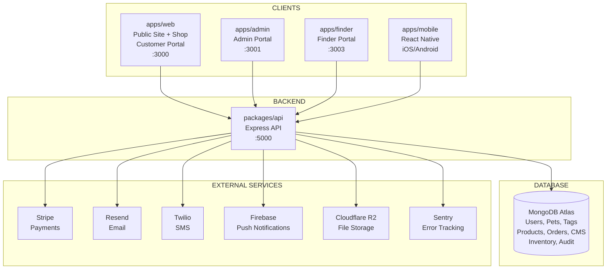

---

## 3. Frontend Applications

### 3.1 apps/web — Public Site + Shop + Customer Portal (Port 3000)

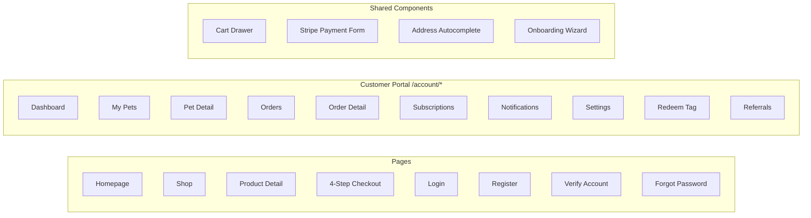

**Key flows:**
- Browse shop → Add to cart → Checkout (4 steps) → Payment → Order confirmation
- Auth: Login → MFA → Dashboard
- Tag activation: Redeem tag → Link to pet → Complete profile

### 3.2 apps/admin — Admin Portal (Port 3001)

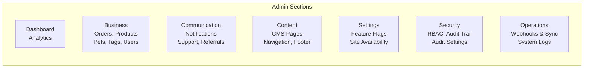

**44 admin pages** with full CRUD, RBAC enforcement, audit logging.

### 3.3 apps/finder — Finder Portal (Port 3003)

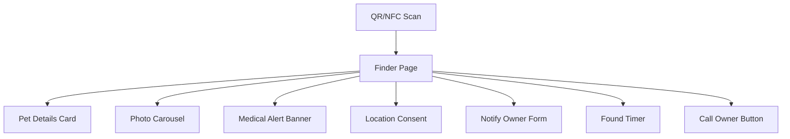

**Public, no auth, rate-limited, CAPTCHA-protected.** Must be tiny and fast — loaded by stressed strangers on phones with poor signal.

### 3.4 apps/mobile — React Native (Expo)

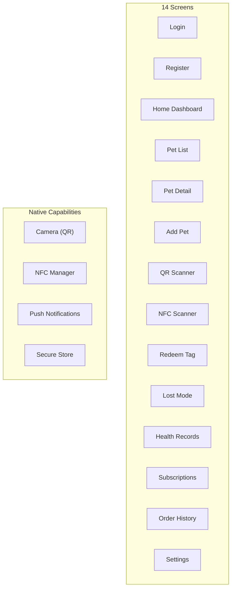

---

## 4. Backend Architecture

### 4.1 Express API (packages/api :5000)

```mermaid
flowchart TB
    subgraph MIDDLEWARE["Middleware Stack"]
        Helmet["Helmet<br/>Security Headers"]
        CORS["CORS<br/>Origin Whitelist"]
        RateLimit["Rate Limiter<br/>DB-Driven"]
        Auth["JWT Auth<br/>RBAC"]
        Audit["Audit Middleware<br/>Auto-Capture"]
        Metrics["Metrics<br/>Request Tracking"]
        Tracing["OpenTelemetry<br/>Correlation IDs"]
        SiteAvail["Site Availability<br/>Maintenance/Offline"]
    end

    subgraph ROUTES["Route Files 35+"]
        AuthR["/auth/*<br/>Login, Register<br/>MFA, OTP"]
        AdminR["/admin/*<br/>Full CRUD<br/>RBAC-Gated"]
        CustomerR["/customer/*<br/>Pets, Orders<br/>Subscriptions"]
        FinderR["/finder/*<br/>Public Tag Lookup<br/>Rate-Limited"]
        CMS["/admin/cms/*<br/>CMS Management<br/>7 Route Files"]
        Webhooks["/webhooks/*<br/>Stripe Webhooks"]
        PublicCMS["/public/cms/*<br/>Public CMS Content"]
    end

    subgraph SERVICES["Services 28"]
        AuthSvc["Auth Service<br/>JWT, bcrypt, OTP"]
        OrderSvc["Order Creation<br/>Direct Stripe"]
        EmailSvc["Email Service<br/>Resend + Templates"]
        StripeSvc["Stripe Service<br/>Payments, Refunds"]
        SubSvc["Subscription<br/>Lifecycle Management"]
        NotifSvc["Notification<br/>Delivery Service"]
        EscalationSvc["Escalation<br/>30-Min Polling"]
        AuditSvc["Audit Service<br/>SHA-256 Hash Chain"]
        ShipSvc["Shipping<br/>Courier Integration"]
        InvoiceSvc["Invoice HTML<br/>Generation"]
        InventorySvc["Inventory<br/>Stock Management"]
        ReferralSvc["Referral<br/>Reward Processing"]
        ReminderSvc["Reminder<br/>Finder + Onboarding"]
        PushSvc["Push Notification<br/>Expo + Firebase"]
        SMSSvc["SMS Service<br/>Twilio"]
        R2Svc["R2 Service<br/>File Upload"]
    end

    MIDDLEWARE --> ROUTES
    ROUTES --> SERVICES
```

### 4.2 API Route Map

| Route Prefix | File | Purpose | Auth |
|-------------|------|---------|------|
| `/api/auth/*` | `auth.ts` | Login, register, MFA, OTP, password reset | Public |
| `/api/admin/*` | `admin.ts` | Full CRUD for all entities | Admin RBAC |
| `/api/admin/rbac/*` | `rbac.ts` | Roles, permissions, groups | Admin RBAC |
| `/api/admin/cms/*` | `cms-*.ts` (7 files) | CMS content management | Admin RBAC |
| `/api/admin/analytics/*` | `admin-analytics.ts` | Dashboard metrics | Admin RBAC |
| `/api/admin/subscriptions/*` | `admin-subscriptions.ts` | Subscription management | Admin RBAC |
| `/api/admin/support-requests/*` | `support.ts` | Support ticket management | Admin RBAC |
| `/api/admin/audit/*` | `audit.ts` | Audit trail viewer | Admin RBAC |
| `/api/admin/system-logs/*` | `system-logs.ts` | System log viewer | Admin RBAC |
| `/api/admin/site-availability/*` | `site-availability.ts` | Maintenance/offline controls | Admin RBAC |
| `/api/admin/webhooks/*` | `admin-webhooks.ts` | Webhook dashboard API | Admin RBAC |
| `/api/customer/*` | `customer.ts` | Pets, orders, tags, notifications | Customer JWT |
| `/api/customer/subscriptions/*` | `customer-subscriptions.ts` | Subscription management | Customer JWT |
| `/api/finder/*` | `finder.ts` | Public tag lookup, notify, location | Public + CAPTCHA |
| `/api/invoice/*` | `invoice-access.ts` | Invoice secure access | Token-based |
| `/api/referrals/*` | `referrals.ts` | Referral program | Customer JWT |
| `/api/push-tokens/*` | `push-tokens.ts` | Push token registration | Customer JWT |
| `/api/support/*` | `support.ts` | Public contact form | Public |
| `/api/upload/*` | `upload.ts` | File uploads (R2) | Auth required |
| `/api/public/cms/*` | `cms-public*.ts` | Public CMS content | Public |
| `/api/public/system/*` | `system-status.ts` | System health status | Public |
| `/api/address/*` | `address-autocomplete.ts` | Address autocomplete proxy | Public |
| `/api/health` | `health.ts` | Health check endpoint | Public |
| `/api/webhooks/stripe` | `webhooks.ts` | Stripe webhook receiver | Stripe signature |
| `/api/customer/checkout-otp/*` | `checkout-otp.ts` | Dual OTP checkout verification | Customer JWT |

### 4.3 Background Jobs

| Job | File | Interval | Purpose |
|-----|------|----------|---------|
| Reminder Service | `reminder.service.ts` | 1 hour | Finder reminders (24h) + onboarding nudges (3+ days) |
| Subscription Lifecycle | `subscription.service.ts` | 1 minute | Expiry checks, grace periods, auto-renewal |
| Escalation Polling | `escalation.service.ts` | 1 minute | 30-min deadline after pet found |
| Low Stock Check | `lowStockCheck.ts` | 24 hours | Admin alerts for low inventory |

### 4.4 Middleware Stack

```mermaid
flowchart LR
    Request["Incoming Request"] --> Helmet["Helmet<br/>Security Headers"]
    Helmet --> CORS["CORS<br/>Origin Check"]
    CORS --> JSON["JSON Parser<br/>10MB limit"]
    JSON --> RateLimit["Rate Limiter<br/>DB-Driven"]
    RateLimit --> PinoHTTP["Pino HTTP<br/>Request Logging"]
    PinoHTTP --> Metrics["Metrics<br/>Duration + Count"]
    Metrics --> Tracing["Tracing<br/>Correlation IDs"]
    Tracing --> SiteAvail["Site Availability<br/>Maintenance Block"]
    SiteAvail --> Audit["Audit Middleware<br/>Auto-Capture"]
    Audit --> Auth["JWT Auth<br/>Token Verify"]
    Auth --> Permission["RBAC<br/>Permission Check"]
    Permission --> Route["Route Handler"]
    Route --> Validation["Zod Validation<br/>Input Check"]
    Validation --> Controller["Business Logic"]
```

---

## 5. Data Architecture

### 5.1 MongoDB Models (46 models)

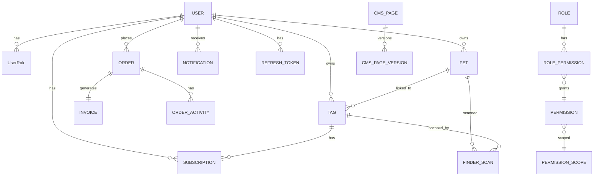

**Model Categories:**

| Category | Models | Purpose |
|----------|--------|---------|
| **Core Business** | User, Pet, Tag, Order, Product, Subscription, Invoice | Core entities |
| **Finder & Escalation** | FinderScan, LocationEvent, EscalationRecord | Pet recovery |
| **Notifications** | Notification, PushToken, TagExpiryNotification | User alerts |
| **Auth & Security** | RefreshToken, VerificationToken, InvoiceAccessToken | Auth flows |
| **RBAC** | Role, Permission, PermissionGroup, PermissionScope, RolePermission, UserRole | Access control |
| **CMS** | CmsPage, CmsNavigation, CmsFooter, CmsEmailTemplate, CmsSmsTemplate, CmsOnboarding, CmsHomepageSection, CmsShopPage, CmsAuthPage, CmsPetReference, CmsAnnouncement, CmsMedia, CmsRedirect, CmsPageVersion | Content management |
| **System** | Setting, FeatureFlag, SystemLog, AuditEvent, WebhookEvent, SupportRequest, Cart, Referral, ReferralCode | Infrastructure |

---

## 6. Authentication & Authorization

### 6.1 Authentication Flow

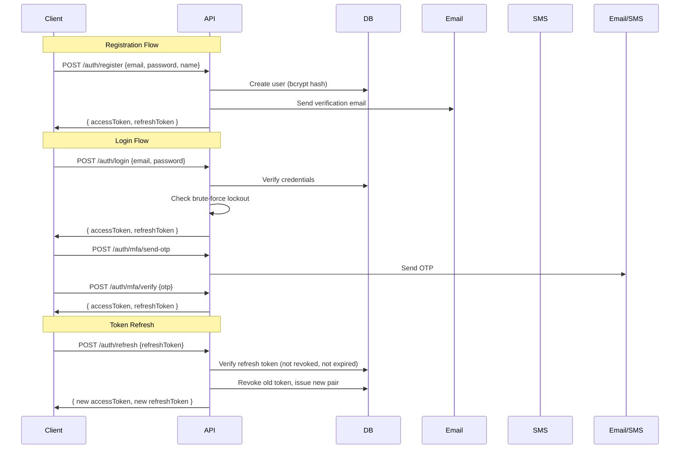

### 6.2 RBAC Permission Model

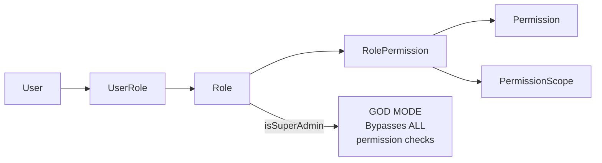

**Roles:** SUPER_ADMIN, ADMIN, CUSTOMER_SERVICE, WEBSITE_EDITOR, CUSTOMER

**Permission format:** `resource.action` (e.g., `order.read`, `user.update`)

**Scope:** OWN (own records only) or ALL (all records)

### 6.3 Security Layers

| Layer | Mechanism | Config |
|-------|-----------|--------|
| Password | bcrypt (12 salt rounds) | — |
| JWT | HS256, 30-min access, 30-day refresh | `JWT_SECRET` |
| Brute-force | 5 attempts → 30min lockout | DB setting |
| CAPTCHA | Math-based after 2 failed attempts | JWT-signed, 5min expiry |
| Rate Limiting | DB-driven, per-endpoint | `rateLimit.*` settings |
| CORS | Origin whitelist | `ALLOWED_ORIGINS` env |
| Audit | SHA-256 hash chain | `audit.policy.*` settings |

---

## 7. E-Commerce Architecture

### 7.1 Checkout Flow (4-Step Wizard)

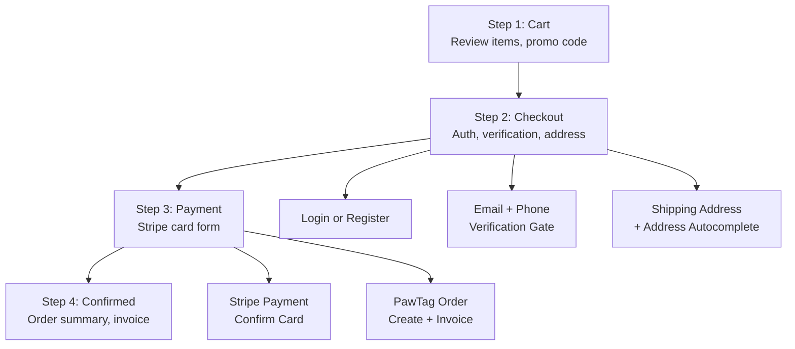

### 7.2 Order Lifecycle

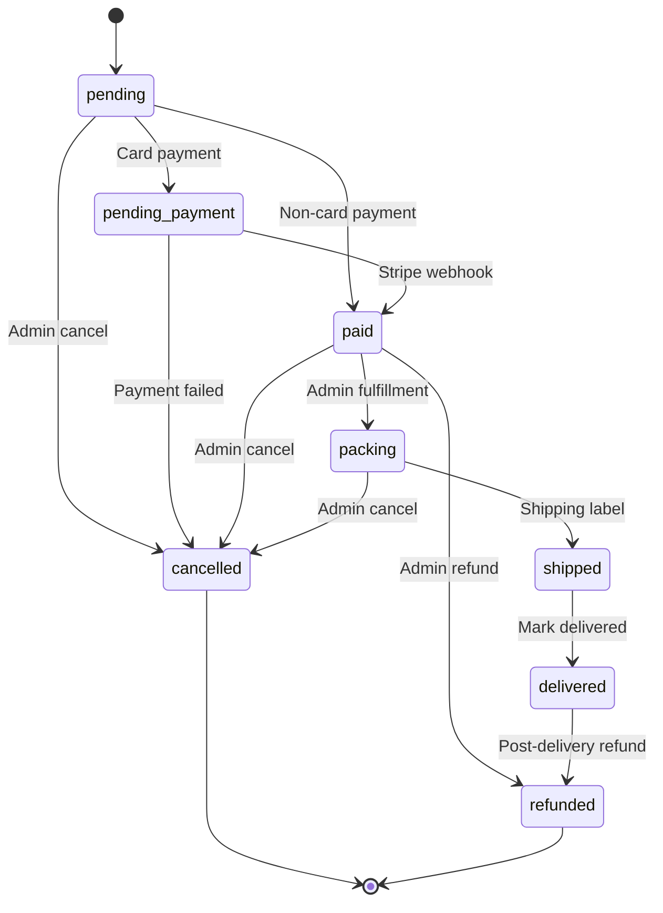

---

## 8. External Integrations

### 8.1 Integration Map

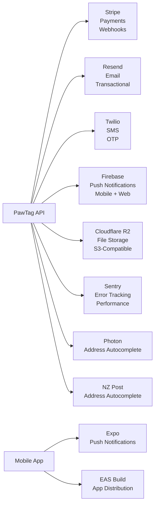

### 8.2 Email Templates (13)

| Template | Trigger |
|----------|---------|
| `welcome.ts` | New user registration |
| `verification-email.ts` | Email verification link |
| `mfa-otp.ts` | MFA OTP code |
| `phone-otp.ts` | Phone OTP code |
| `password-reset.ts` | Password reset link |
| `password-changed.ts` | Password change confirmation |
| `login-notification.ts` | New login alert |
| `account-status.ts` | Account status change |
| `order-confirmation.ts` | Order placed confirmation |
| `shipping-notification.ts` | Shipping notification |
| `pet-found.ts` | Pet found notification |
| `base.ts` | Base email wrapper |
| `index.ts` | Template registry |

### 8.3 Notification Types

| Type | Trigger | Channels |
|------|---------|----------|
| `pet_lost` | Owner marks pet as lost | In-app, Push, Email |
| `pet_found` | Finder reports found pet | In-app, Push, Email |
| `finder_scan` | Finder scans tag | In-app, Push |
| `finder_reminder` | 24h after finder scan | In-app, Email |
| `order_update` | Order status changes | In-app, Push, Email |
| `new_order` | New order placed | In-app, Email (admin) |
| `subscription_expiring` | Subscription expiring | In-app, Email |
| `tag_expiry_warning` | Tag expiring | In-app, Email |
| `referral_reward` | Referral bonus | In-app, Email |
| `escalation` | Pet found, owner unresponsive | In-app, Push, Email |
| `support_request` | New support request | In-app (admin) |
| `low_stock` | Product low stock | In-app (admin) |
| `system` | System announcements | In-app |

---

## 9. CMS Architecture

### 9.1 CMS Models

| Model | Purpose |
|-------|---------|
| CmsPage | Dynamic pages with PuckEditor JSON |
| CmsPageVersion | Page version history |
| CmsNavigation | Header navigation items |
| CmsFooter | Footer configuration |
| CmsHomepageSection | Homepage sections |
| CmsShopPage | Shop page content |
| CmsAuthPage | Login/register page customization |
| CmsEmailTemplate | Email template management |
| CmsSmsTemplate | SMS template management |
| CmsOnboarding | Onboarding wizard config |
| CmsPetReference | Pet breed/color/pattern data |
| CmsAnnouncement | Banner and popup announcements |
| CmsMedia | Media library |
| CmsRedirect | URL redirects |

### 9.2 PuckEditor Block Types (36)

| Category | Blocks |
|----------|--------|
| **Layout** | HeroBanner, CtaBanner, FeaturesGrid, CardsGrid, ColumnsBlock, ImageTextBlock |
| **Content** | RichTextBlock, TextBlock, ImageBlock, ImageGallery, VideoEmbed, CustomHtml, AccordionBlock, TabsBlock, IconListBlock, BadgeBlock |
| **Commerce** | PricingTable |
| **Social** | TestimonialsSection, TeamBlock, PartnersLogos, SocialLinksBlock |
| **Interactive** | FaqAccordion, ContactForm, NewsletterSignupBlock |
| **Utility** | ButtonBlock, SpacerBlock, DividerBlock, EmbedBlock, BackToTopBlock, MarqueeBlock, AlertBlock |
| **Data** | TimelineSection, StatsCounter, MapBlock, CountdownBlock, AnnouncementBarBlock |

---

## 10. Observability Stack

### 10.1 Logging Pipeline

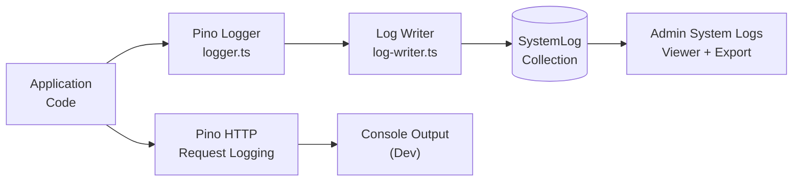

### 10.2 Audit Trail

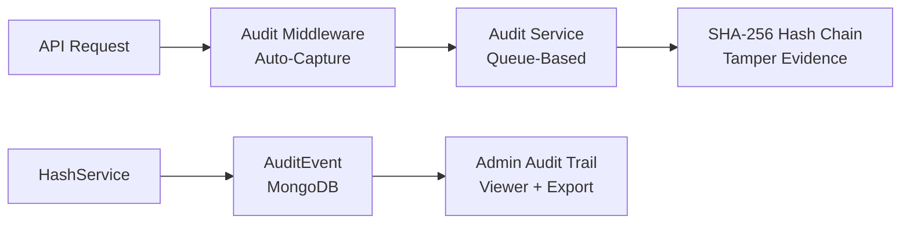

### 10.3 Tracing & Metrics

| Component | Technology | Purpose |
|-----------|------------|---------|
| Structured Logging | Pino → MongoDB | Application logs |
| Distributed Tracing | OpenTelemetry | Request correlation |
| Metrics | Custom middleware | Request duration, error rates |
| Health Check | `GET /api/health` | MongoDB connectivity |
| Error Tracking | Sentry | Production error capture |

---

## 11. Site Availability

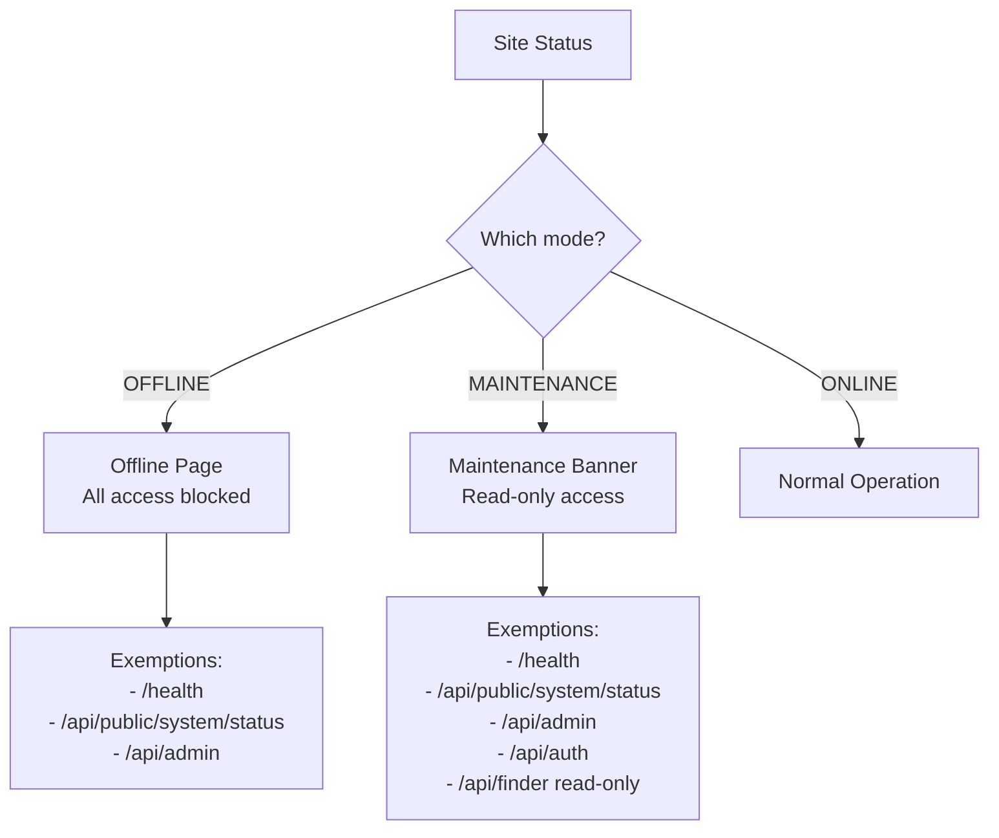

**Settings:** 7 `site.*` settings in `seed-cms.ts`

---

## 12. Deployment Architecture

### 12.1 Docker Services

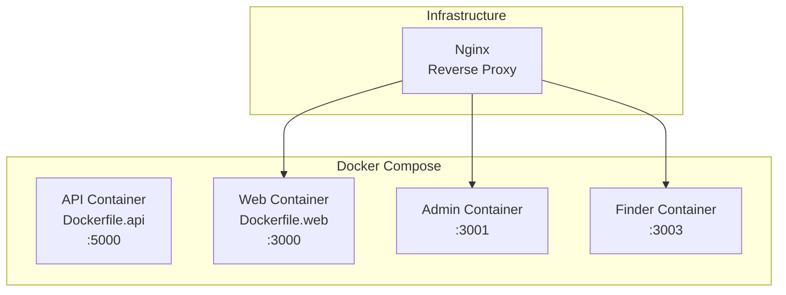

### 12.2 Production Deployment (Planned)

| Layer | Service | Status |
|-------|---------|--------|
| API | Render (Docker) | Pending accounts |
| Web | Vercel | Pending accounts |
| Admin | Vercel | Pending accounts |
| Finder | Vercel | Pending accounts |
| Mobile | Expo EAS | Pending accounts |
| Database | MongoDB Atlas | Active |
| Commerce | PawTag Commerce (MongoDB) | Active |

---

## 13. Testing Architecture

### 13.1 Test Structure

```text
tests/
├── unit/              → 25 unit test files
├── integration/       → 32 integration test files (MongoDB Memory Server)
├── smoke/             → 1 smoke test file
├── regression/        → 2 regression test files
├── setup.ts           → Test setup
└── AUDIT-REPORT.md    → Audit report
```

### 13.2 Test Commands

```bash
pnpm test              # Run all tests
pnpm test:unit         # Unit tests only
pnpm test:integration  # Integration tests only
pnpm test:smoke        # Smoke tests only
pnpm test:regression   # Regression tests only
pnpm test:coverage     # With coverage report
```

### 13.3 CI/CD Pipeline

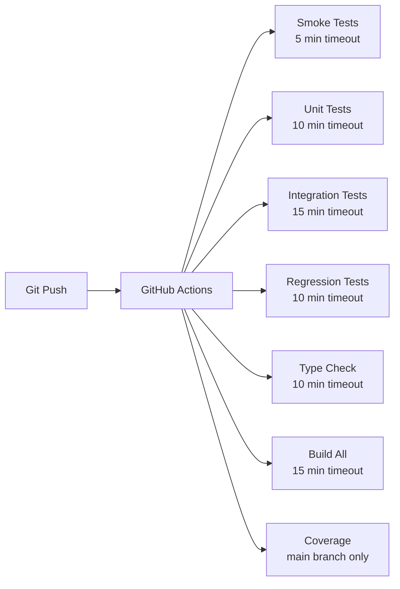

---

## 14. Key File Reference

### 14.1 Core Files

| File | Purpose |
|------|---------|
| `packages/api/src/index.ts` | Express app setup, middleware, routes, jobs |
| `packages/api/src/config.ts` | Environment configuration |
| `packages/api/src/routes/admin.ts` | Admin CRUD routes (3600+ lines) |
| `packages/api/src/routes/customer.ts` | Customer routes (2500+ lines) |
| `packages/api/src/routes/finder.ts` | Finder portal routes (747 lines) |
| `packages/api/src/routes/auth.ts` | Authentication routes |
| `packages/api/src/routes/webhooks.ts` | Stripe webhook handlers |
| `packages/api/src/services/order-creation.service.ts` | Order creation logic |
| `packages/api/src/services/orderNotification.service.ts` | Customer notifications |
| `packages/api/src/middleware/auth.ts` | JWT authentication |
| `packages/api/src/middleware/permission.ts` | RBAC permission check |
| `packages/api/src/middleware/audit.ts` | Audit logging middleware |
| `packages/api/src/middleware/captcha.ts` | CAPTCHA verification |
| `packages/api/src/middleware/site-availability.ts` | Maintenance/offline mode |
| `packages/api/src/lib/logger.ts` | Structured logging (Pino) |
| `packages/api/src/lib/rate-limiter.ts` | DB-driven rate limiter |
| `packages/api/src/services/audit/audit.service.ts` | Enterprise audit logging |
| `packages/api/src/seeds/seed.ts` | RBAC + user seeding |
| `packages/api/src/seeds/seed-cms.ts` | CMS settings + content seeding |

### 14.2 Frontend Files

| File | Purpose |
|------|---------|
| `apps/web/src/pages/Checkout.tsx` | 4-step checkout wizard |
| `apps/web/src/pages/account/Orders.tsx` | Customer orders (30s polling) |
| `apps/web/src/pages/account/OrderDetail.tsx` | Order detail (30s polling) |
| `apps/web/src/context/CartContext.tsx` | Cart context (PawTag-native) |
| `apps/web/src/components/StripePaymentForm.tsx` | Stripe Elements form |
| `apps/web/src/components/CheckoutAuth.tsx` | Inline auth for checkout |
| `apps/web/src/components/CheckoutVerificationGate.tsx` | OTP verification gate |
| `apps/web/src/components/OnboardingWizard.tsx` | Dynamic onboarding |
| `apps/web/src/components/AccountLayout.tsx` | Customer portal layout |
| `apps/admin/src/components/Sidebar.tsx` | Admin sidebar (7 sections) |
| `apps/finder/src/App.tsx` | Finder portal (10 components) |
| `packages/ui/src/components/*.tsx` | 14 shared components |

### 14.3 Database Files

| File | Purpose |
|------|---------|
| `packages/db/src/models/Order.ts` | Order model (stripePaymentIntentId, activity timeline) |
| `packages/db/src/models/User.ts` | User model (RBAC, MFA) |
| `packages/db/src/models/Tag.ts` | Tag model (nfcEnabled, orderId) |
| `packages/db/src/models/Pet.ts` | Pet model (medical, photos) |
| `packages/db/src/models/WebhookEvent.ts` | Webhook event tracking |
| `packages/db/src/models/AuditEvent.ts` | Audit trail with hash chain |
| `packages/db/src/models/SystemLog.ts` | System logs with TTL |
| `packages/db/src/models/Setting.ts` | DB-driven configuration |
| `packages/db/src/models/Notification.ts` | Notification (customer + admin) |

---

## 15. Environment Variables

### 15.1 Required

| Variable | Description |
|----------|-------------|
| `DB_URL` | MongoDB Atlas connection string |
| `JWT_SECRET` | JWT signing secret (min 32 chars) |

### 15.2 Authentication

| Variable | Default | Description |
|----------|---------|-------------|
| `JWT_ACCESS_EXPIRES_IN` | `30m` | Access token lifetime |
| `REFRESH_TOKEN_EXPIRES_IN_DAYS` | `30` | Refresh token lifetime |

### 15.3 External Services

| Variable | Service | Purpose |
|----------|---------|---------|
| `STRIPE_SECRET_KEY` | Stripe | Payment processing |
| `RESEND_API_KEY` | Resend | Transactional email |
| `TWILIO_ACCOUNT_SID` | Twilio | SMS/OTP |
| `TWILIO_AUTH_TOKEN` | Twilio | SMS authentication |
| `TWILIO_FROM_NUMBER` | Twilio | SMS sender |
| `R2_ACCESS_KEY_ID` | Cloudflare R2 | File storage |
| `R2_SECRET_ACCESS_KEY` | Cloudflare R2 | File storage auth |
| `R2_BUCKET_NAME` | Cloudflare R2 | Storage bucket |
| `R2_ENDPOINT` | Cloudflare R2 | API endpoint |
| `SENTRY_DSN` | Sentry | Error tracking |

### 15.5 Server

| Variable | Default | Description |
|----------|---------|-------------|
| `PORT` | `5000` | API server port |
| `NODE_ENV` | `development` | Environment |
| `ALLOWED_ORIGINS` | localhost:3000-3003 | CORS whitelist |
| `ADMIN_ALERT_EMAIL` | — | Admin notification email |

---

## 16. Known Issues & Technical Debt

### 16.1 Current Bugs

| Issue | Severity | Location |
|-------|----------|----------|
| Order creation fails silently — frontend swallows error | **Critical** | `Checkout.tsx:336-338` |
| Confirmation page always shows "email sent" (hardcoded) | **High** | `Checkout.tsx:926-935` |
| Emails from `onboarding@resend.dev` go to spam (Yahoo) | **Medium** | `email.service.ts:92` |

### 16.2 Technical Debt

| Item | Impact |
|------|--------|
| Legacy `role: string` field on User model | Being replaced by RBAC |
| `restoreOrderStock()` is a no-op | PawTag owns inventory |
| `checkout-otp.ts` uses `console.error` | Should use structured logger |
| No Redis-backed rate limiting | Won't survive multi-instance |

### 16.3 Pending Implementation

| Item | Status |
|------|--------|
| CI/CD pipeline (Render/Vercel) | Blocked — needs accounts |
| E2E tests (Playwright/Maestro) | Not started |
| Frontend Sentry error boundaries | Not started |
| Affiliate Marketplace (Phases 27-32) | Not started |

---

## 17. Quick Reference

### 17.1 Dev Commands

```bash
pnpm install              # Install dependencies
pnpm dev:all              # Start all services
pnpm dev:api              # API only (:5000)
pnpm dev:admin            # Admin only (:3001)
pnpm dev:web              # Web only (:3000)
pnpm dev:finder           # Finder only (:3003)
pnpm build                # Build all packages
pnpm typecheck            # Type-check all packages
pnpm test                 # Run all tests
pnpm test:coverage        # Run with coverage
```

### 17.2 Default Accounts

| Role | Email | Password |
|------|-------|----------|
| Admin | admin@pawtag.co.nz | (set via BOOTSTRAP_ADMIN_PASSWORD) |
| Test Customer | arpanbhagat@yahoo.com | PawTagTest2024! |

### 17.3 Ports

| Service | Port |
|---------|------|
| Web | 3000 |
| Admin | 3001 |
| Finder | 3003 |
| API | 5000 |
