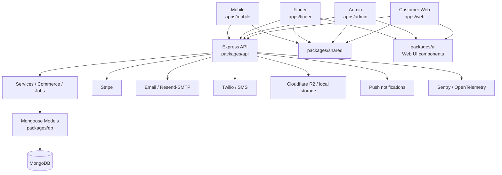

# PawTag — Pet Recovery & Commerce Platform

PawTag is a pet recovery platform built around QR/NFC-enabled pet tags, owner profiles, finder-assisted recovery, notifications, and supporting commerce.

The core product loop is:

> **Acquire/activate a tag → attach it to a pet → mark the pet lost → a finder scans the tag → the owner is notified → owner and finder reconnect safely.**

This repository also contains customer commerce, subscriptions/Guardian benefits, an admin portal, CMS capabilities, operational tooling, and a React Native mobile application.

> [!IMPORTANT]
> **Current status: pre-MVP production hardening.**
>
> The application contains substantial implemented functionality, but the repository should **not be treated as production-ready solely because a feature exists in code**. A pre-MVP audit identified several production-only and failure-path issues that must be fixed or validated before the first real customer launch.
>
> The source code is the source of truth. Documentation describes intent and operating guidance, but it must not override observed runtime behaviour.

---

## Contents

- [Product Purpose](#product-purpose)
- [Current MVP Status](#current-mvp-status)
- [First-Customer Launch Principle](#first-customer-launch-principle)
- [Applications](#applications)
- [Architecture](#architecture)
- [Repository Structure](#repository-structure)
- [Technology Stack](#technology-stack)
- [Prerequisites](#prerequisites)
- [Local Setup](#local-setup)
- [Environment Configuration](#environment-configuration)
- [Running the Platform](#running-the-platform)
- [Build, Typecheck, Lint and Tests](#build-typecheck-lint-and-tests)
- [Database](#database)
- [Authentication and Authorization](#authentication-and-authorization)
- [Finder Experience](#finder-experience)
- [Commerce and Payments](#commerce-and-payments)
- [Cart UX Direction](#cart-ux-direction)
- [Mobile Strategy](#mobile-strategy)
- [Admin Portal](#admin-portal)
- [Background Jobs](#background-jobs)
- [External Integrations](#external-integrations)
- [Observability](#observability)
- [Production Readiness Gaps](#production-readiness-gaps)
- [Deployment](#deployment)
- [AI-Assisted Development Rules](#ai-assisted-development-rules)
- [Documentation Map](#documentation-map)
- [Development Conventions](#development-conventions)
- [MVP Scope Guidance](#mvp-scope-guidance)
- [Definition of Ready for First Customer](#definition-of-ready-for-first-customer)

---

# Product Purpose

PawTag exists to make it easier and faster to reunite lost pets with their owners.

## Primary users

### Pet owners

Pet owners can use PawTag to:

- create and manage an account;
- create pet profiles;
- store pet information and health-related details;
- activate PawTag tags;
- mark a pet as lost;
- receive finder/recovery notifications;
- manage contacts and notification preferences;
- shop for PawTag products;
- manage carts, checkout, orders, invoices and eligible subscriptions;
- access customer account settings and support.

### Finders

A finder may be a stranger who has just found a lost pet. They may:

- be using a phone;
- have poor connectivity;
- be stressed or in a hurry;
- have no PawTag account;
- have never seen PawTag before.

The finder journey must therefore remain one of the smallest, fastest and least complicated experiences in the platform.

### PawTag staff

Admin/CSR/editor users operate the system through the admin portal, including:

- user/pet/tag administration;
- commerce and order operations;
- payments/refunds;
- subscriptions;
- CMS/content management;
- support;
- audit/system logs;
- RBAC and configuration.

---

# Current MVP Status

The repository is not a thin prototype. It contains real implementations for authentication, RBAC, pet/tag management, finder flows, commerce, Stripe integration, notifications, audit logging, CMS functions, background jobs, mobile-native integrations, CI and automated tests.

However, **implemented does not mean launch-ready**.

The current engineering stage is:

> **Feature-rich pre-MVP application undergoing production hardening, cross-layer validation and launch-scope reduction.**

## Readiness overview

| Area | Current state | MVP position |
|---|---|---|
| Customer web | Substantially implemented | Needs production hardening and E2E validation |
| Pet profiles | Implemented | Validate critical workflows |
| Tag activation | Implemented | Validate end-to-end |
| Lost mode / recovery | Implemented | Critical path; must be production-tested |
| Finder portal | Implemented | Contains launch-blocking integration/privacy concerns to resolve |
| Cart | Implemented | Functional foundation; UX redesign planned |
| Checkout | Implemented | Requires security/data-integrity hardening |
| Stripe payments | Implemented | Requires webhook/configuration/failure-path validation |
| Orders/refunds | Implemented | Requires reconciliation and idempotency validation |
| Guardian/subscriptions | Implemented in code | Validate billing lifecycle before depending on it commercially |
| Admin portal | Broadly implemented | Focus on operational safety, RBAC and destructive actions |
| CMS | Broadly implemented | Supporting feature; not core to first-customer proof |
| Mobile app | Meaningfully implemented | Not yet recommended as a first-customer launch dependency |
| Background jobs | DB-driven scheduler with admin UI, locking, notifications | Production-ready |
| Automated API tests | Substantial | Critical browser/native E2E coverage still needed |
| Deployment | Docker/CI foundations exist | Production environment still needs rehearsal and validation |
| Observability | Logging/Sentry/OpenTelemetry hooks exist | Alerts/runbooks must be validated in staging/production-like conditions |

---

# First-Customer Launch Principle

The first customer launch is not blocked by architectural perfection.

It **is** blocked if any of the following are true:

- a finder cannot reliably notify an owner;
- anonymous users can access data they should not see;
- one customer can affect another customer's order/payment state;
- Stripe events cannot be verified and processed reliably;
- a customer can be charged without PawTag reaching a recoverable order state;
- inventory or refunds can be duplicated through retries/concurrency;
- demo/test behaviour can accidentally run in live commerce;
- critical jobs can execute multiple times with financial or customer consequences;
- production configuration is not fail-safe;
- backups, monitoring and rollback have never been exercised;
- the primary user journeys have only been validated manually in development mode.

PawTag should optimize for:

1. safety;
2. reliability;
3. customer/finder experience;
4. maintainability;
5. reasonable implementation effort;
6. scalability when usage actually requires it.

Do **not** introduce large infrastructure or framework migrations simply to make the architecture look more "enterprise".

---

# Applications

PawTag is a pnpm workspace monorepo with four applications and shared packages.

| Application | Path | Dev port | Primary audience |
|---|---|---:|---|
| Customer Web | `apps/web` | `3000` | Public visitors and pet owners |
| Admin | `apps/admin` | `3001` | PawTag staff |
| Finder | `apps/finder` | `3003` | Anyone who scans a PawTag |
| Mobile | `apps/mobile` | Expo | Pet owners |
| API | `packages/api` | `5000` | All clients |

## Customer web

`apps/web` contains:

- public site/shop;
- authentication;
- customer account areas;
- pet/tag management;
- checkout and commerce UI;
- Guardian/reward/subscription-related UI;
- support/profile/settings experiences.

## Admin

`apps/admin` contains desktop-oriented operational interfaces for:

- users;
- pets;
- tags;
- products/catalog;
- orders;
- payments/refunds;
- fulfilment/shipping;
- subscriptions;
- Guardian/rewards;
- CMS;
- support;
- RBAC;
- audit and system logs;
- settings and integrations.

Admin is primarily a **desktop operational tool**. Perfect mobile responsiveness is not a first-MVP priority unless a specific staff workflow requires it.

## Finder

`apps/finder` is intentionally separate from the main web app.

That separation is valuable because the finder experience has different priorities:

- extremely fast initial load;
- minimal UI complexity;
- no account requirement;
- mobile-first interaction;
- resilient errors;
- careful public-data exposure;
- strong abuse protection without unnecessarily blocking legitimate finders.

## Mobile

`apps/mobile` is a React Native / Expo application with native capabilities including:

- camera/QR interaction;
- NFC;
- push notifications;
- secure token storage;
- native navigation;
- pet/tag/account screens.

The mobile application should share **business logic, API contracts, validation and design tokens** where practical, while keeping native rendering and native-device behaviour platform-specific.

---

# Architecture



## Intended dependency direction

The practical architecture is:

```text
Applications
    ↓
shared contracts / web UI
    ↓
API routes + middleware
    ↓
services / domain orchestration
    ↓
database models + external integrations
```

Routes should generally:

1. validate input;
2. authenticate/authorize;
3. call a domain/service function;
4. map the result to an HTTP response.

Business rules should not be duplicated across clients or hidden only in frontend validation.

## Important architectural reality

PawTag is **not strict traditional MVC**, and it does not need to become strict MVC.

The useful layering target is:

> **Route/controller → domain/service → persistence/integration**

Some older/larger route files currently contain more orchestration than this target. Refactor these incrementally when modifying the relevant feature; do not perform a repository-wide rewrite solely for architectural purity.

---

# Repository Structure

```text
PawTag/
├── apps/
│   ├── web/                  # Customer/public React application
│   ├── admin/                # Staff/admin React application
│   ├── finder/               # Public finder React application
│   └── mobile/               # React Native / Expo application
│
├── packages/
│   ├── api/                  # Express API, routes, services, jobs, integrations
│   ├── db/                   # Mongoose models and DB connection
│   ├── shared/               # Shared TypeScript/API contracts and helpers
│   └── ui/                   # Shared WEB React UI components + Tailwind preset
│
├── tests/
│   ├── unit/
│   ├── integration/
│   ├── regression/
│   └── smoke/
│
├── docs/                     # Architecture, operations, product and engineering docs
├── docker/                   # Dockerfiles, nginx config, compose config
├── scripts/                  # Maintenance/backfill/index scripts
├── .github/workflows/        # CI workflow
├── AGENTS.md                 # AI/developer operating guidance
├── opencode.json             # OpenCode configuration
├── pnpm-workspace.yaml
├── vitest.config.ts
└── package.json
```

## Repository snapshot

At the time of this README refresh, the tree contains approximately:

- **63** Mongoose model files in `packages/db/src/models`;
- **57** API route files in `packages/api/src/routes`;
- **22** top-level API service files in `packages/api/src/services` plus additional domain/service folders;
- **54** admin page components;
- **22** customer-web page components;
- **10** finder components;
- **15** mobile screen files;
- **24** web UI components in `packages/ui/src/components`;
- **94** root test files: 56 unit, 35 integration, 2 regression and 1 smoke;
- **3** Maestro mobile E2E flow files.

These counts are descriptive only and will change over time. **Do not use counts as a proxy for quality or readiness.**

---

# Technology Stack

## Backend

- Node.js (repository engine: `>=18`; CI currently uses Node 20)
- TypeScript
- Express 4
- MongoDB / Mongoose 7
- Zod
- JWT / bcryptjs
- Stripe SDK
- Pino / pino-http
- Sentry
- OpenTelemetry
- AWS S3-compatible SDK for Cloudflare R2

## Web/Admin/Finder

- React 18
- TypeScript
- Vite
- React Router 6
- Axios
- Tailwind CSS / shared Tailwind preset
- Lucide icons
- Stripe.js / React Stripe.js in customer web

## Mobile

- Expo SDK 54
- React Native 0.81
- React 19
- React Navigation 7
- `expo-camera`
- `react-native-nfc-manager`
- `expo-notifications`
- `expo-secure-store`

## Tooling

- pnpm workspaces
- Vitest 4
- Supertest
- MongoDB Memory Server
- Maestro mobile E2E
- ESLint
- Prettier
- GitHub Actions
- Docker / Nginx

---

# Prerequisites

For local development:

- Node.js 20 recommended to match CI;
- pnpm 9+;
- Git;
- MongoDB connection (local MongoDB or Atlas);
- optional provider accounts depending on the feature being exercised.

Install pnpm if needed:

```bash
npm install -g pnpm@9
```

---

# Local Setup

```bash
# Clone
git clone https://github.com/bhagatarpan/PawTag.git
cd PawTag

# Install workspace dependencies
pnpm install

# API environment
cp packages/api/.env.example packages/api/.env

# Edit packages/api/.env before starting the API

# Optional development seed
pnpm --filter @pawtag/api seed

# Start API + web + admin + finder
pnpm dev:all
```

## Important seed warning

Development seed data and demo credentials are **development conveniences**, not production configuration.

Never assume seeded accounts/settings are safe for a live environment. In particular:

- set a strong explicit production bootstrap admin password;
- do not seed demo customers into production unless intentionally required;
- review commerce/payment mode after seeding;
- do not deploy `sk_test_demo_key` or equivalent demo provider values;
- do not expose OTPs or secrets through production logs.

---

# Environment Configuration

The checked-in starting point is:

```text
packages/api/.env.example
```

The application reads additional integration/observability variables in code, so `.env.example` should be kept synchronized as integrations evolve.

## Core variables

| Variable | Purpose | Production expectation |
|---|---|---|
| `NODE_ENV` | Runtime mode | `production` in live API |
| `PORT` | API port | Deployment-specific |
| `DB_URL` | MongoDB connection | Required |
| `JWT_SECRET` | JWT signing secret | Required; strong secret |
| `JWT_ACCESS_EXPIRES_IN` | Access-token lifetime | Review before launch |
| `REFRESH_TOKEN_EXPIRES_IN_DAYS` | Refresh lifetime | Review before launch |
| `ALLOWED_ORIGINS` | CORS origins | Explicit live domains |
| `FRONTEND_URL` | Customer web URL | Live customer domain |
| `ADMIN_URL` | Admin URL | Live admin domain |
| `FINDER_URL` | Finder URL | Live finder domain |

## Bootstrap variables

| Variable | Purpose |
|---|---|
| `BOOTSTRAP_ADMIN_EMAIL` | Initial admin email |
| `BOOTSTRAP_ADMIN_PASSWORD` | Initial admin password |
| `BOOTSTRAP_TEST_EMAIL` | Development test user |
| `BOOTSTRAP_TEST_PASSWORD` | Development test password |

## Payments

| Variable | Purpose |
|---|---|
| `STRIPE_SECRET_KEY` | Stripe server API key |
| `STRIPE_WEBHOOK_SECRET` | Stripe webhook signature secret |
| `VITE_STRIPE_PUBLISHABLE_KEY` | Customer-web Stripe publishable key |

> [!CAUTION]
> PawTag has code/configuration paths for demo/test payment behaviour. **A production deployment must explicitly prove that live checkout cannot silently operate in demo mode.** Production startup/configuration should fail safely when required payment configuration is missing or unsafe.

## Email and SMS

Common variables used by the API include:

- `RESEND_API_KEY`
- `SMTP_HOST`
- `SMTP_PORT`
- `SMTP_SECURE`
- `SMTP_USER`
- `SMTP_PASS`
- `ADMIN_ALERT_EMAIL`
- `SMS_PROVIDER`
- `TWILIO_ACCOUNT_SID`
- `TWILIO_AUTH_TOKEN`
- `TWILIO_FROM_NUMBER`

## Storage

- `STORAGE_DRIVER`
- `LOCAL_UPLOADS_DIR`
- `R2_ACCESS_KEY_ID`
- `R2_SECRET_ACCESS_KEY`
- `R2_BUCKET_NAME`
- `R2_ENDPOINT`
- `R2_PUBLIC_URL`

Local filesystem storage is appropriate for development. Production storage should use durable object storage and must not rely on ephemeral container disk.

## Push notifications

The API contains Firebase-related configuration paths including:

- `FIREBASE_PROJECT_ID`
- `FIREBASE_CLIENT_EMAIL`
- `FIREBASE_PRIVATE_KEY`

The mobile application also depends on the Expo/EAS project configuration for production push behaviour.

## Observability

Common variables include:

- `LOG_LEVEL`
- `SENTRY_DSN`
- `SENTRY_RELEASE`
- `SENTRY_SAMPLE_RATE`
- `SENTRY_TRACES_SAMPLE_RATE`
- `SERVICE_NAME`
- `SERVICE_VERSION`
- `OTEL_EXPORTER_OTLP_ENDPOINT`
- `OTEL_SAMPLE_RATE`
- `OTEL_CONSOLE_EXPORTER`

## Other integrations

The codebase also contains integration/configuration paths for shipping/address services and Xero, including variables such as:

- `SHIPPING_PROVIDER_API_KEY`
- `NZPOST_CLIENT_ID`
- `COMMERCE_SHIPPING_NZPOST_CLIENT_ID`
- `XERO_CLIENT_ID`
- `XERO_CLIENT_SECRET`
- `XERO_REDIRECT_URI`

Do not configure integrations merely because support exists in code. Enable only the capabilities required by the current launch scope.

---

# Running the Platform

## All browser/API applications

```bash
pnpm dev:all
```

This starts:

- API: `http://localhost:5000`
- Customer web: `http://localhost:3000`
- Admin: `http://localhost:3001`
- Finder: `http://localhost:3003`

## Individual services

```bash
pnpm dev:api
pnpm dev:web
pnpm dev:admin
pnpm dev:finder
```

## Mobile

```bash
cd apps/mobile
pnpm start
```

Or:

```bash
pnpm android
pnpm ios
```

Native features such as NFC, push notifications and some camera behaviour require appropriate physical-device builds/configuration and should not be considered validated solely through a simulator or Expo web mode.

## API documentation

When the API is running:

```text
http://localhost:5000/api/docs
http://localhost:5000/api/docs.json
```

Swagger coverage is useful but should not be assumed to enumerate every implementation detail or guarantee endpoint correctness.

---

# Build, Typecheck, Lint and Tests

## Build

```bash
pnpm build
```

Individual builds:

```bash
pnpm build:shared
pnpm build:db
pnpm build:api
pnpm build:web
pnpm build:admin
pnpm build:finder
```

The root build currently builds shared/db first and then API/admin/web/finder.

Mobile production builds are managed separately through Expo/EAS rather than the root `pnpm build` command.

## Typecheck

```bash
pnpm typecheck
```

## Lint

```bash
pnpm lint
```

## Tests

```bash
# Default Vitest run
pnpm test

# Suites
pnpm test:unit
pnpm test:integration
pnpm test:smoke
pnpm test:regression

# Combined named suites
pnpm test:all

# Coverage
pnpm test:coverage

# Watch mode
pnpm test:watch
```

## Mobile E2E

From `apps/mobile`:

```bash
pnpm e2e
pnpm e2e:qr
pnpm e2e:nfc
pnpm e2e:lost
```

The repository contains Maestro flows for QR activation, NFC activation and lost mode. These flows should be validated on appropriately configured device builds before mobile launch.

## Current coverage configuration

`vitest.config.ts` currently enforces relatively low global API thresholds:

- lines: 15%
- functions: 15%
- branches: 10%
- statements: 15%

These thresholds are a floor, **not a readiness target**.

For MVP, confidence should come from testing the important business journeys and failure paths, not from chasing an arbitrary percentage.

## CI

`.github/workflows/ci.yml` currently runs on pushes/pull requests to `main` and `develop` and includes:

- smoke tests;
- unit tests;
- integration tests with MongoDB;
- regression tests;
- TypeScript typecheck;
- root build;
- coverage generation on `main`.

The root CI workflow does **not currently constitute full browser/native end-to-end certification**.

---

# Database

PawTag uses MongoDB with Mongoose.

`packages/db/src/models` contains the persistent domain models for areas including:

- accounts/authentication;
- pets/tags;
- finder/recovery events;
- notifications;
- products/catalog;
- carts/orders/payments/refunds;
- subscriptions/rewards;
- fulfilment/shipping;
- CMS;
- RBAC;
- audit/system logs;
- integrations/settings.

## Database guidance

When modifying data behaviour:

- enforce important invariants server-side;
- use unique/compound indexes when they protect correctness or real query patterns;
- avoid adding indexes speculatively without understanding write/storage cost;
- use transactions selectively for multi-document operations that must remain consistent;
- design retries/idempotency for operations involving external systems;
- use explicit ownership conditions in customer-scoped queries;
- treat soft-delete filters consistently;
- test concurrent commerce/recovery scenarios where duplicate processing matters.

## Utility scripts

The repository includes scripts for indexes, backfills and migrations under `scripts/`.

Treat any data-changing script as an operational change:

1. review it;
2. run against staging/test data first;
3. capture backups where appropriate;
4. make it idempotent or explicitly one-time;
5. document the expected result;
6. verify before running against production.

---

# Authentication and Authorization

The application contains:

- JWT access tokens;
- persisted refresh tokens;
- refresh-token rotation/revocation;
- password hashing;
- email/phone verification flows;
- password-reset flows;
- MFA/OTP capability;
- account lockout/rate-limit mechanisms;
- RBAC permissions for staff/admin actions;
- audit logging.

## Current web token model

The browser clients currently use local-storage-based token storage through the shared API client.

That architecture is functional but increases impact if browser XSS occurs. Migration of long-lived browser credentials toward secure `HttpOnly` cookie-based handling is a security-hardening consideration.

Do not make authentication architecture changes casually. Changes must preserve:

- refresh rotation;
- logout/session invalidation;
- admin/customer separation;
- mobile SecureStore support;
- CSRF protections if cookie-based authentication is introduced.

## Authorization rule

Authentication is not authorization.

Every customer-owned resource must be protected by server-side ownership checks. Never rely on:

- hidden UI controls;
- route names;
- frontend state;
- possession of a resource/payment identifier;
- client-side validation.

Staff/admin operations must use the correct RBAC permission and should generate appropriate audit records for sensitive actions.

---

# Finder Experience

The Finder experience is a **tier-one critical workflow**.

The intended flow is:

```text
Scan QR/NFC
   ↓
Load public pet/recovery view
   ↓
Finder decides whether/how to contact owner
   ↓
Optional location sharing with clear consent
   ↓
Notify owner
   ↓
Clear confirmation + next-step guidance
```

## Finder rules

The Finder application must remain:

- accountless;
- mobile-first;
- understandable under stress;
- tolerant of poor connectivity;
- careful with location consent;
- explicit about success/failure;
- resistant to abuse/spam;
- intentionally minimal in the private data it exposes.

## Public-data design

Do not return an internal Pet document shape to an anonymous finder and rely on the frontend to hide fields.

Use an explicit public Finder DTO/projection containing only information intentionally approved for public display.

Health, owner-contact and identifier data require special care.

## Production validation

A Finder feature is not considered complete until its client/server contract has been exercised under **production-like middleware/configuration**, including abuse-protection behaviour.

This matters because development/test bypasses can hide integration defects that only appear under `NODE_ENV=production` semantics.

---

# Commerce and Payments

PawTag Commerce includes code for:

- catalog/products/variants;
- carts;
- server-side price calculation/revalidation;
- promo/discount handling;
- shipping;
- Stripe PaymentIntents;
- pending orders;
- orders;
- payment transactions;
- inventory reservation/movement;
- fulfilment/shipments;
- invoices;
- cancellations;
- returns/refunds;
- subscriptions/Guardian-related billing;
- reconciliation jobs and operational admin tools.

## Commerce correctness principles

### Never trust client pricing

The server must remain authoritative for:

- product price;
- variant/customization price;
- discounts;
- loyalty/reward application;
- shipping;
- tax/GST treatment;
- order totals.

### Make retries safe

Financial actions may be retried due to:

- browser refresh;
- network timeout;
- mobile reconnect;
- provider retry;
- webhook retry;
- worker restart;
- user double submission.

Important actions therefore need explicit idempotency behaviour.

### Payment success is not the end of the transaction

A customer payment can succeed while a later local operation fails.

The system must be able to detect and repair states such as:

```text
Stripe succeeded
but
order/tag/subscription/invoice/inventory finalization did not fully complete
```

Do not solve this by swallowing errors. Persist enough state to reconcile or alert an operator.

### Webhook integrity

Stripe webhook handling must preserve the raw request body required for signature verification and should reject unverifiable events.

Webhook event IDs should remain idempotently tracked to prevent replay/duplicate side effects.

## Membership Tiers

PawTag offers a **three-tier membership system** as paid add-ons that provide enhanced benefits:

### Pricing

| Tier | Price | Billing |
|------|-------|---------|
| Gold | $89/year | Annual renewal |
| Platinum | $99/year | Annual renewal |
| Black | $199/year | Annual renewal (Coming Soon) |

### Benefits by Tier

| Benefit | Gold | Platinum | Black |
|---------|------|----------|-------|
| Points multiplier | 1× | 2× | 3× |
| Free shipping threshold | $100 | $80 | Lifetime free |
| Medical alerts | ✓ | ✓ | ✓ |
| Pet health records | ✓ | ✓ | ✓ |
| Emergency contacts | Basic | ✓ | ✓ |
| Accessory discount | 0% | 5% | 10% |
| Pet recovery assistance | ✓ | ✓ | ✓ |
| Black Friday deals | - | - | ✓ |

### Key Features

- **Annual renewal:** Memberships renew yearly automatically
- **Cancellation:** Members receive email detailing lost benefits, benefits continue until period end
- **Tier management:** Members can upgrade/downgrade tiers via customer portal
- **Email notifications:** Renewal reminders (30/7 days), cancellations, tier changes send confirmation emails

### Technical Details

- **Endpoint:** `POST /api/membership/subscribe` — Create membership subscription
- **Endpoint:** `POST /api/membership/activate` — Activate after payment
- **Detection:** Use `/api/customer/guardian/tier` endpoint (returns tier info)
- **Configuration:** Membership tiers managed via Admin → Membership → Tier Configuration

---

# Cart UX Direction

## Cart Isolation Rule

**PRODUCT, MEMBERSHIP, and DIGITAL must never be mixed in the same cart.** Each product type has its own isolated cart. When a customer adds a product to a cart, the cart's product type is set. Attempting to add a different product type will return an error message explaining the restriction.

## Cart Types

| Cart Type | Products | Shipping |
|-----------|----------|----------|
| Physical Products | Tags, accessories, physical items | Required |
| Membership | Gold, Platinum, Black memberships | Not required |
| Digital Products | Digital downloads, online content | Not required |

The target PawTag cart is **not** a single flat list with a basic subtotal.

The recommended MVP commerce pattern is:

## Mini-cart drawer

Use the drawer for immediate feedback after add-to-cart:

- product image/name;
- selected variant;
- engraving/customization summary;
- quantity control;
- concise price;
- obvious remove control;
- cart item count;
- subtotal/estimated summary;
- prominent `View cart` / `Checkout` actions.

The mini-cart should be fast and compact. It should **not** be forced to carry the full checkout-information architecture.

## Full cart page — premium desktop layout

Desktop/tablet target:

```text
┌───────────────────────────────────────────────────────────────┐
│                         YOUR CART                             │
├────────────────────────────────────────────┬──────────────────┤
│                                            │                  │
│  ~70% CART CONTENT                         │  ~30% SUMMARY    │
│                                            │  sticky          │
│  Product card                              │                  │
│  Image                                     │  Subtotal        │
│  Product / variant                         │  Discounts       │
│  Engraving / personalization               │  Shipping info   │
│  Quantity                                  │  GST/tax note    │
│  Availability / changes                    │  Gold benefits   │
│  Unit + line price                         │  Savings         │
│                                            │  ─────────────   │
│  Additional products                       │  Estimated total │
│                                            │                  │
│  Relevant benefits / reassurance           │  CHECKOUT CTA    │
│                                            │                  │
└────────────────────────────────────────────┴──────────────────┘
```

### Desktop principles

- roughly **70/30** content-to-summary split;
- sticky order summary while cart items scroll;
- strong product imagery and hierarchy;
- visible personalization/engraving;
- explicit price/inventory changes;
- transparent savings and totals;
- membership benefits shown once, clearly;
- useful reassurance near checkout without clutter;
- accessible buttons and quantity controls;
- no decorative motion that competes with checkout.

### Mobile principles

Do **not** force 70/30 onto mobile.

Use a deliberate single-column mobile composition with:

- product cards first;
- condensed summary below or in a clear collapsible section;
- optionally a sticky bottom checkout bar with total + CTA;
- large touch targets;
- no hover-dependent interactions;
- preserved context after quantity/remove changes.

### Accessibility

The drawer/page must include:

- accessible names for icon-only actions;
- keyboard-operable quantity/remove controls;
- appropriate dialog semantics/focus management for the drawer;
- visible focus states;
- live feedback where totals or validation change;
- reduced-motion respect.

The cart redesign should **reuse the existing commerce/domain logic** unless correctness findings require service changes. Do not rewrite the cart backend solely to achieve a new visual layout.

---

# Mobile Strategy

The goal is **high reuse without forcing artificial 100% UI sharing**.

## Share where it makes sense

Good cross-platform candidates include:

- API endpoint definitions;
- DTOs/types;
- validation/business rules;
- formatting helpers;
- domain state/reducers where platform-neutral;
- design tokens;
- component contracts/specifications;
- analytics/event names.

## Keep platform-specific where appropriate

Native-specific implementations should remain native for areas such as:

- navigation;
- camera;
- QR scanning;
- NFC;
- push notifications;
- permissions;
- secure storage;
- gestures;
- native pickers/controls;
- app lifecycle;
- deep links/background behaviour.

## UI architecture direction

`packages/ui` should remain a **web React component library**.

Do not attempt to render existing DOM/Tailwind components directly inside React Native.

A future platform-neutral design-token package can provide one source of truth for:

- semantic colours;
- spacing;
- typography scales;
- radii;
- motion duration/easing;
- status semantics.

Web and mobile can then render those shared concepts using their appropriate platform components.

Do not migrate the whole product to React Native Web, Tamagui, NativeWind, gluestack or another cross-platform framework simply to increase code-sharing percentage. Introduce a new framework only if a real measured problem justifies the migration cost.

---

# Admin Portal

The Admin Portal is an operational interface, not a consumer mobile product.

MVP priorities are:

- correctness;
- RBAC;
- clear permission boundaries;
- safe destructive actions;
- auditability;
- efficient desktop workflows;
- searchable/filterable data;
- accessible dialogs/forms/tables;
- clear financial state;
- clear success/failure feedback.

High-risk actions include:

- refunding money;
- cancelling orders;
- changing subscriptions;
- changing payment/test configuration;
- changing roles/permissions;
- destructive content/media actions;
- operational overrides.

Sensitive operations should provide appropriate confirmation and audit context, including actor, timestamp, previous/current state and external transaction identifiers where relevant.

Avoid spending first-MVP effort making every admin table perfect on narrow mobile screens unless staff genuinely need that workflow in the field.

---

# Background Jobs

PawTag uses a **DB-driven job scheduler** with centralized configuration, locking, execution history, and admin UI.

## Architecture

```text
HTTP API process(es)
        ↓
      MongoDB

ONE dedicated worker process (or API process in dev)
        ↓
Job Scheduler (reads config from BackgroundJob collection)
        ↓
Individual job functions (pure, no self-managing timers)
        ↓
job_locks collection (concurrency safety)
```

## Job List

| Job | Category | Frequency | Purpose |
|---|---|---|---|
| Reminder Service | notification | 1 hour | Finder reminders, onboarding nudges |
| Subscription Service | financial | 1 hour | Subscription lifecycle, auto-renewals, payment retries |
| Escalation Service | notification | 1 minute | Emergency contact notifications |
| Low Stock Check | maintenance | 24 hours | Admin alerts for low inventory |
| Pet Milestones | notification | 24 hours | Birthday/anniversary points |
| PawRewards | financial | 24 hours | Monthly rewards, tier re-qualification |
| Orphan Payment Detection | financial | 60 seconds | Recovers payments without orders |
| Order Auto-Cancel | financial | 60 seconds | Cancels stale unpaid orders |
| Shipping Tracking Poll | maintenance | 5 minutes | Carrier API tracking updates |
| Webhook Retry | financial | 60 seconds | Retries failed Stripe webhooks |
| Payment Reconciliation | reconciliation | 5 minutes | Compares local vs Stripe state |
| Refund Reconciliation | reconciliation | 24 hours | Syncs refund status from Stripe |
| Privacy Retention | compliance | 24 hours | Anonymizes finder data per retention policy |
| Audit Retention | compliance | 24 hours | Enforces audit event retention policies |

## Admin Portal

All jobs are configurable via **Admin Portal → Operations → Background Jobs**:

- View job status, last run, duration
- Enable/disable jobs
- Configure intervals, lock lease, process target
- Set per-job notification preferences
- Trigger immediate execution
- View execution history (last 500 runs)
- Purge old history entries

## Job Locking

All financially-sensitive jobs use MongoDB-based locking via `job_locks` collection:

- Atomic claim/release with configurable lease (default 2 minutes)
- Prevents duplicate execution across multiple workers
- Worker ID tracks which process holds the lock

## Notifications

- **Per-job**: Configure notify-on-success and notify-on-failure per job
- **Global**: Default settings for all jobs (configurable in Admin Portal)
- **Email**: Sent to admin email address
- **In-app**: Created as admin notifications

## Production Deployment

In production, run a dedicated worker process:

```bash
PAWTAG_WORKER_ROLE=worker node packages/api/dist/worker.js
```

In development, the API process starts jobs automatically (with locking to prevent duplicates).

---


# External Integrations

The repository contains integration code/configuration for several external services.

| Integration | Use |
|---|---|
| Stripe | Payments/subscriptions/refunds |
| Resend / SMTP | Email |
| Twilio | SMS/OTP |
| Firebase / Expo | Push-related capabilities |
| Cloudflare R2 | Durable object storage |
| Shipping/address providers | Shipping/tracking/address assistance |
| Xero | Accounting-related integration paths |
| Sentry | Error monitoring |
| OpenTelemetry | Tracing/telemetry |

## Integration rule

Every external integration needs explicit behaviour for:

- credentials missing;
- provider timeout;
- provider error;
- duplicate request/event;
- retry;
- local success + remote failure;
- remote success + local failure;
- staging vs production configuration.

Demo fallbacks are useful during development, but **must never create false success in production**.

---

# Observability

The API contains structured logging and monitoring foundations including:

- Pino / pino-http;
- database-backed system logging;
- audit events;
- Sentry integration;
- OpenTelemetry tracing hooks;
- request metrics middleware;
- process-level fatal exception handling;
- health-related routes.

## Production-readiness rule

Logging is not the same as monitoring.

Before launch, validate that critical conditions create actionable signals, for example:

- webhook processing failures;
- paid-but-not-finalized orders;
- reconciliation mismatches;
- repeated notification failures;
- worker/job failures;
- elevated authentication abuse;
- storage/provider outages;
- API health degradation.

An alert should have an owner and a response path.

---

# Production Readiness Gaps

A code-level pre-MVP audit identified several areas that must be fixed or validated before real-customer launch.

This section deliberately describes categories rather than publishing exploit instructions.

## Must address before first customer

### Finder production contract

The Finder notify flow must be exercised under production-like CAPTCHA/abuse-protection configuration. Development/test bypasses must not hide client/server contract failures.

### Payment/webhook correctness

Verify raw Stripe webhook signature processing, event idempotency and provider failure handling end-to-end.

### Checkout authorization

Customer checkout/order/payment recovery paths must preserve strict ownership boundaries under every fallback/retry path.

### Financial consistency and recovery

Checkout involves multiple local/external operations. Define what must be atomic and what must enter a durable repair/reconciliation state when later steps fail.

### Safe production payment configuration

Production must not silently run demo/test payment behaviour when commerce is enabled.

### Finder privacy projection

Anonymous Finder responses must expose only explicitly approved public fields rather than broad internal health/contact subdocuments.

### Background-job ownership

Scheduled work needs either a single controlled worker or distributed claiming/idempotency before multiple API instances are used.

### Browser/native E2E validation

Critical cross-layer journeys need automated production-like tests. API unit/integration coverage alone is not sufficient.

### Mobile launch gate

Before mobile is treated as launch-ready, validate its authentication storage adapter, QR scanning, NFC decoding, push configuration, permissions and real-device lifecycle behaviour.

### Deployment/recovery rehearsal

Builds, production environment validation, database backup/restore, alerting and rollback must be exercised before first customer.

## Security reporting

If a detailed security audit or vulnerability report is maintained, keep exploit-sensitive details in an appropriate non-public engineering/security document rather than this README.

---

# Deployment

The repository contains:

- `docker/Dockerfile.api`
- `docker/Dockerfile.web`
- `docker/docker-compose.yml`
- `docker/nginx.conf`
- GitHub Actions CI
- environment/release/rollback documentation under `docs/`.

These are deployment foundations, **not proof of production readiness**.

## Local Docker

```bash
docker compose -f docker/docker-compose.yml up -d
```

Build individual services as required:

```bash
docker compose -f docker/docker-compose.yml build api
docker compose -f docker/docker-compose.yml build web
docker compose -f docker/docker-compose.yml build admin
docker compose -f docker/docker-compose.yml build finder
```

## Before production

At minimum validate:

1. clean build from the committed lockfile;
2. actual production container/static builds;
3. environment-variable fail-fast behaviour;
4. MongoDB indexes/migrations/backfills;
5. CORS/live domains;
6. Stripe live/test separation and webhooks;
7. durable media storage;
8. outbound email/SMS behaviour;
9. worker ownership;
10. monitoring/alerts;
11. backup restoration;
12. rollback procedure;
13. production-like E2E journeys.

Do not choose Render, Vercel, AWS, Azure or any other hosting platform merely because old documentation names it. Choose hosting based on the current operational requirements and validate the actual deployment configuration used.

---

# AI-Assisted Development Rules

PawTag has been developed heavily with AI assistance. AI coding is an accepted part of this project, but generated code must be treated like code from any other contributor: **inspect, test and verify it**.

OpenCode/AI assistants should follow these rules.

## 1. Read before editing

Before changing a feature:

- inspect the route/component/service/model involved;
- inspect callers and tests;
- inspect shared types/contracts;
- search for duplicate implementations;
- understand the failure path, not only the happy path.

Do not infer behaviour from this README alone.

## 2. Work in small work packets

Prefer:

> one problem → focused change → tests → verification → commit

Avoid prompts such as:

> "Make PawTag production-ready."

Large autonomous refactors make regressions and hidden assumptions difficult to detect.

## 3. Do not weaken security to make a test/UI work

Never resolve an integration issue by:

- removing authorization;
- broadening resource queries;
- bypassing ownership checks;
- disabling CAPTCHA/rate limits in production;
- accepting unsigned webhooks;
- trusting client prices;
- turning a provider error into fake success.

Fix the actual client/server contract.

## 4. Do not hide type problems with `as any`

Use `any`/casts only when unavoidable and justified.

If the compiler identifies a mismatch between async/sync storage, API types, model data or provider SDK shapes, fix the contract rather than suppressing it.

## 5. Backend enforcement is authoritative

Frontend validation improves UX. It is **not** a security/business-rule boundary.

The API must enforce:

- ownership;
- permissions;
- pricing;
- inventory rules;
- allowed state transitions;
- refund/cancellation rules;
- input validation.

## 6. Preserve idempotency

Any work involving payments, orders, inventory, notifications, refunds, webhooks or jobs must explicitly consider duplicate execution.

## 7. Add regression tests for every production bug

A bug fix is incomplete if the same bug can silently return later.

For cross-layer defects, prefer a test at the layer that would actually have caught the issue.

## 8. Do not over-engineer

Do not introduce:

- microservices;
- Redis;
- Kafka;
- new state-management frameworks;
- a new UI framework;
- a repository-wide pattern rewrite

unless a demonstrated current problem requires them.

## 9. Keep documentation honest

When functionality changes:

- update relevant docs;
- remove stale claims;
- do not write "production-ready" without evidence;
- describe limitations explicitly.

## 10. Stop at acceptance criteria

For phased MVP work, complete one defined work packet, verify it, report the changed files/tests, then stop for review rather than expanding scope opportunistically.

---

# Documentation Map

The repository contains detailed documents under `docs/`. Useful starting points include:

| Document | Purpose |
|---|---|
| `docs/ARCHITECTURE.md` | Architecture context |
| `docs/COMPLETE-ARCHITECTURE.md` | Broader architecture reference |
| `docs/DESIGN.md` | Design language/system guidance |
| `docs/database-schema.md` | Database reference |
| `docs/business-workflows.md` | Business workflow notes |
| `docs/BUSINESS-RULES.md` | Business rules |
| `docs/AUTH-FLOWS.md` | Authentication flows |
| `docs/environments.md` | Environment guidance |
| `docs/release-process.md` | Release process |
| `docs/rollback.md` | Rollback guidance |
| `docs/disaster-recovery.md` | Disaster-recovery notes |
| `docs/launch-checklist.md` | Launch checklist |
| `docs/OBSERVABILITY-ARCHITECTURE.md` | Observability design |
| `docs/OBSERVABILITY-RUNBOOK.md` | Monitoring/runbook guidance |
| `docs/LOGGING.md` | Logging guidance |
| `docs/mobile-ux-audit.md` | Mobile UX review |
| `docs/ORDER-DATA-FLOWS.md` | Commerce/order data-flow notes |
| `docs/STRIPE_REFUND_IMPLEMENTATION.md` | Refund implementation notes |

> Documentation may lag implementation. Always verify important claims against source code and tests.

## AI/development material

- `AGENTS.md`
- `opencode.json`
- `skills/`

These are development/AI-coding aids. They are not a production MCP/Model Context Protocol feature of the customer application.

---

# Development Conventions

## TypeScript

- keep strict typing meaningful;
- prefer explicit domain types over broad casts;
- avoid duplicate request/response interfaces when a shared contract exists;
- handle null/undefined intentionally.

## API

- validate public mutations;
- authenticate and authorize server-side;
- keep route handlers thin where practical;
- place reusable business behaviour in services/domain modules;
- return consistent error semantics;
- avoid leaking internal provider/database errors to clients.

## Database

- preserve ownership filters;
- understand query/index impact;
- use transactions where multi-document consistency requires them;
- use atomic updates/claims for concurrent work;
- keep soft-delete behaviour consistent.

## React

- split components/pages by responsibility when they become difficult to reason about;
- do not extract tiny components solely to satisfy a file-size target;
- keep data/business behaviour out of purely presentational components;
- provide loading, empty, success and error states;
- do not rely on effects with stale dependencies/state.

## UX

Every important workflow should handle:

- initial loading;
- empty state;
- validation;
- recoverable error;
- non-recoverable error;
- success confirmation;
- disabled/in-progress actions;
- mobile layout;
- keyboard/focus behaviour where relevant.

## Accessibility

At minimum consider:

- semantic HTML;
- labels;
- keyboard navigation;
- focus management;
- accessible dialog/drawer behaviour;
- visible focus;
- screen-reader names for icon buttons;
- status/error announcements;
- touch targets;
- reduced motion.

---

# MVP Scope Guidance

The first customer launch should prove the core PawTag value, not every possible platform capability.

## MVP core

Prioritize:

- account/authentication required for customers;
- pet profile;
- tag activation;
- lost mode;
- Finder scan/recovery;
- owner notifications;
- safe owner/finder reconnection;
- buying a tag/product;
- reliable checkout/payment/order creation;
- basic order/refund/support operations;
- minimum staff administration required to operate safely.

## MVP supporting

Keep only where required by launch/business model:

- Membership tiers (Gold, Platinum, Black);
- rewards;
- basic CMS;
- shipping integration;
- notification preferences;
- digital products.

## Strong candidates to defer/simplify

Depending on launch needs:

- advanced CMS/editor capability;
- extensive analytics;
- complex loyalty/referral mechanics;
- accounting/Xero automation;
- affiliate/marketplace plans;
- nonessential administrative customization;
- mobile release if responsive web is sufficient for first customers.

Deferring a feature does not require deleting it. It may simply mean hiding it from launch scope until its workflow has been hardened and supported operationally.

---

# Definition of Ready for First Customer

PawTag is ready for a controlled first-customer release only after the team can provide evidence for the following.

## Recovery

- [ ] A real/production-like tag can be scanned on a phone.
- [ ] Public Finder data is intentionally minimized.
- [ ] Finder can notify the owner under production abuse-protection settings.
- [ ] Location permission denial has a usable fallback.
- [ ] Duplicate/repeated finder actions do not create harmful duplicate side effects.
- [ ] Notification failure is visible/recoverable.
- [ ] Owner can acknowledge/complete the recovery workflow.

## Authentication/security

- [ ] Registration/login/verification/password reset work end-to-end.
- [ ] Refresh/logout/session behaviour has been tested.
- [ ] Ownership tests cover customer-scoped resources.
- [ ] Admin destructive/financial actions require correct permissions.
- [ ] Live secrets are not committed/logged.
- [ ] Production CORS/rate-limit/proxy configuration has been validated.

## Commerce

- [ ] Server remains authoritative for all totals.
- [ ] Live/test Stripe configuration cannot be confused.
- [ ] Stripe webhook signatures are verified successfully.
- [ ] Duplicate payment/webhook actions are idempotent.
- [ ] Concurrent inventory behaviour has been tested.
- [ ] Paid-but-incomplete orders enter a repairable/alerted state.
- [ ] Refund/cancellation workflows are idempotent and auditable.
- [ ] Reconciliation has been exercised against test Stripe data.

## Cart/checkout UX

- [ ] Mini-cart is accessible and gives clear add/update feedback.
- [ ] Full cart uses the approved premium 70/30 desktop composition.
- [ ] Mobile cart has a deliberate single-column design.
- [ ] Customization/engraving, discounts, shipping/GST information and totals are clear.
- [ ] Checkout errors preserve customer progress where safe.

## Operations

- [ ] Background jobs have clear single-worker/claim ownership.
- [ ] Production build/deployment has been rehearsed.
- [ ] Backup **restore** has been tested, not only backup creation.
- [ ] Monitoring alerts reach a real person.
- [ ] Rollback has been rehearsed.
- [ ] Staff know how to identify and repair payment/order exceptions.

## Testing

- [ ] Critical browser E2E covers the core recovery journey.
- [ ] Critical browser E2E covers cart/checkout/order creation.
- [ ] Production-only middleware/configuration is represented in relevant tests.
- [ ] Regression tests exist for all launch-blocking defects fixed during hardening.
- [ ] Mobile native flows pass on real devices if mobile is included in launch.

## Launch decision

The launch decision should be based on verified behaviour, not feature count.

The final question is:

> **Can a real customer buy/activate PawTag, can a real stranger help recover the pet, can the owner be notified safely, can money/order state remain correct under failures/retries, and can staff support the customer when something goes wrong?**

If the answer is demonstrably yes, PawTag is ready for a controlled first-customer release.

---

# License / Ownership

Add the appropriate project license, copyright and contribution terms here if/when the repository is intended for public contribution or external distribution.

